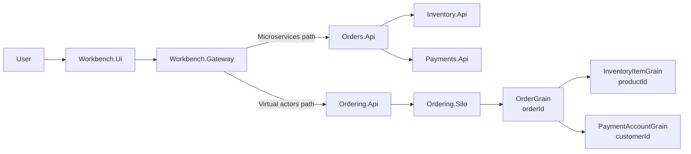

# Problem

This repository compares two ways of implementing the same stateful distributed workflow:

- a microservices-style implementation with explicit service boundaries
- a virtual actor-style implementation with stateful identity boundaries

The workflow is intentionally small: place an order, reserve inventory, authorize payment, and complete or reject the order.

The interesting part is not ecommerce. The interesting part is how each architecture expresses state ownership, concurrency control, failure handling, compensation, deployment, scaling, observability, and long-term evolution.

## Comparison shape

Both implementations are exercised through the same Workbench layer so their externally visible scenario behavior can be compared side by side.

The diagram is intentionally simplified. It shows the comparison boundary and the main ownership paths, not every project, runtime interaction, or infrastructure detail.

## Why this problem is useful

Order placement is a compact example of a common distributed-systems problem. Even in a small workflow, the implementation must answer important questions:

- Who owns inventory state?
- Who prevents over-reservation?
- Who owns the order workflow decision?
- What happens if payment fails after inventory has been reserved?
- What happens if payment times out?
- How are duplicate requests handled safely?
- Where does operational diagnosis happen when a scenario produces an unexpected result?

Microservices and virtual actors can both solve this workflow, but they place the important responsibilities at different boundaries.

## What the comparison is about

The comparison is not intended to prove that one architecture is universally better. It is intended to make trade-offs visible:

- Microservices make deployable service boundaries explicit
- Virtual actors make stateful identity boundaries explicit
- Microservices require explicit coordination across service and data boundaries
- Virtual actors rely on actor identity, serialized execution, and runtime-managed activation
- Both styles still require versioning, observability, testing, and operational discipline

## What the comparison is not about

This project is not a benchmark, a production ecommerce system, or a complete reference architecture.

Local elapsed times are useful for understanding the sample topology, but they should not be interpreted as universal performance results.

The project intentionally keeps the domain small so the architectural differences remain visible.
