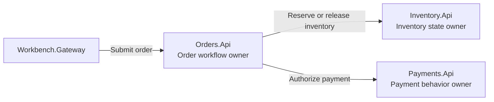
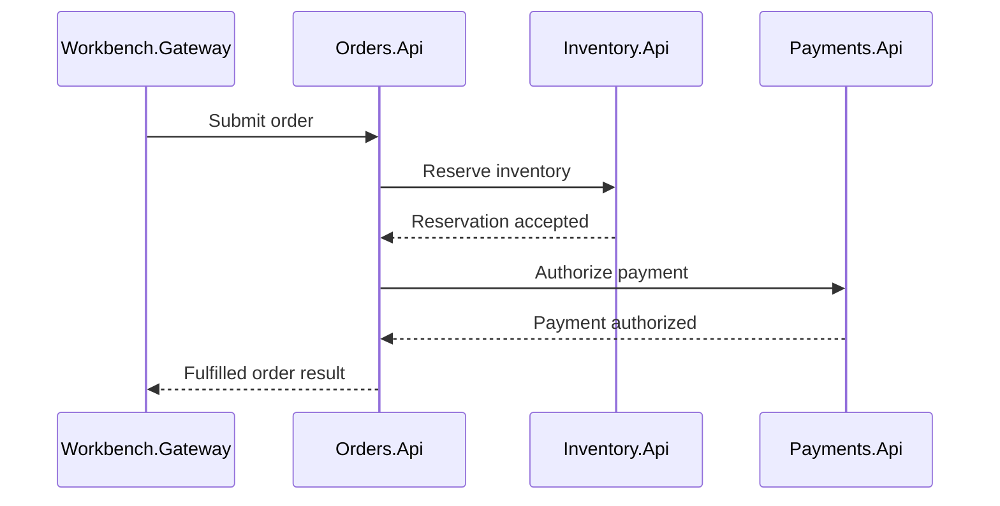
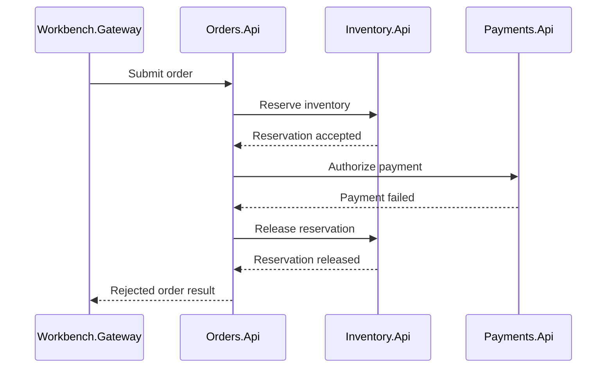

# Microservices design

The microservices-style implementation separates the order workflow into three deployable business capabilities:

- `Orders.Api` owns order workflow coordination
- `Inventory.Api` owns inventory state and reservation invariants
- `Payments.Api` owns payment authorization behavior

Each service owns its data and exposes HTTP APIs for other services to call. This design makes service boundaries, deployment units, explicit coordination, and operational responsibilities visible.

## Architecture at a glance

`Orders.Api` coordinates the workflow, but it does not own inventory or payment state. Those responsibilities remain with the services that own the corresponding business capability.

## Service responsibilities

### Orders.Api

`Orders.Api` owns the order workflow. It accepts order requests, coordinates inventory reservation and payment authorization, records the final order outcome, and returns the externally visible result.

In this design, `Orders.Api` acts as the workflow orchestrator. It asks the services that own inventory and payment state to perform their parts of the workflow and decides how to proceed from their responses.

### Inventory.Api

`Inventory.Api` owns product inventory state. It determines whether inventory is available, creates reservations, releases reservations when compensation is required, and protects inventory under concurrent requests.

The service owns the central inventory invariant:

> Available inventory must never become negative.

### Payments.Api

`Payments.Api` owns payment authorization behavior. It supports the deterministic successful and failed authorization outcomes used by the workbench and returns idempotent results for repeated payment requests.

The payment-timeout scenario models an indeterminate downstream delay as a failed authorization and demonstrates inventory compensation. It is intentionally deterministic and is not a complete production timeout, retry, or reconciliation strategy.

## Workflow coordination

### Successful order

A successful order follows this general path:

The workflow succeeds only after inventory has been reserved and payment has been authorized. `Orders.Api` records and returns the completed order result.

### Payment failure and compensation

A payment failure after reservation follows this general path:

Compensation is explicit. `Orders.Api` decides that the reservation must be released, while `Inventory.Api` remains responsible for performing and protecting the inventory state transition.

## State and consistency

### Inventory invariants

Inventory consistency is protected at the inventory service and persistence boundary. `Inventory.Api` must ensure that only valid reservations are accepted, released reservations restore the correct quantity, and concurrent requests cannot make available inventory negative.

The order service does not infer remaining inventory from its own workflow state. It relies on the inventory owner for reservation results and final inventory observations.

### Concurrency

Under concurrent submissions, multiple independent orders may compete for the same product stock. `Inventory.Api` must serialize or otherwise protect the relevant persistence operations so that completed orders do not exceed the available stock.

This differs from the virtual actor implementation, where per-identity serialization is part of the actor model. In the microservices implementation, concurrency protection is an explicit responsibility of the inventory service and its data-access strategy.

A single hot product remains a contention point in both designs. The architectural difference is how ownership and serialization are expressed, not whether contention exists.

### Idempotency

Duplicate requests are handled through explicit idempotency state. `Orders.Api` owns the relationship between an idempotency key and the logical order result. Repeated submissions should return the established result instead of creating another order or reserving inventory again.

This is especially important when duplicate requests arrive concurrently before the first request has completed. The implementation must protect the idempotency key atomically at its persistence boundary rather than relying only on an initial lookup.

Payment authorization also uses an idempotency key so a repeated authorization request returns the previously persisted outcome.

## Failure handling

The microservices design makes failure paths visible because each remote call can fail independently. The workbench demonstrates cases in which:

- inventory rejects a reservation
- payment fails after inventory has been reserved
- payment times out after inventory has been reserved
- compensation releases a reservation
- duplicate requests race on the same idempotency key
- a dependency is unavailable or reports unhealthy state

The sample keeps these policies deterministic so the comparison remains understandable. Production systems would require additional decisions for retries, timeout budgets, reconciliation, durable workflow recovery, and ambiguous downstream outcomes.

See the [Scenario guide](12-scenario-guide.md) for scenario defaults and expected results, and [Known limitations](17-known-limitations.md) for interpretation boundaries.

## Development observability

The microservices are composed through the .NET Aspire AppHost during development. The Aspire dashboard provides detailed resource state, endpoints, structured logs, distributed traces, and metrics across the composed application.

`Hosting.ServiceDefaults` applies shared service discovery, resilience, health, logging, tracing, and metric configuration. Correlation and scenario instrumentation make it possible to follow one workbench execution across `Workbench.Gateway`, `Orders.Api`, `Inventory.Api`, and `Payments.Api`.

Each API exposes shared readiness and liveness endpoints:

- `/health` represents readiness and can include service-owned persistence checks
- `/alive` represents process liveness

The Workbench Health page combines live health reports with the shared topology model to present architecture groups, nodes, dependencies, and resource availability. The Workbench Topology page remains a static explanation of the intended architecture. These views complement the deeper diagnostics available in the Aspire dashboard.

See [Correlation ID logging](13-correlation-id-logging.md) and [Observability and operations](16-observability-and-operations.md) for detailed guidance.

## Deployment and scaling implications

The microservices backend contains three independently deployable processes:

- `Orders.Api`
- `Inventory.Api`
- `Payments.Api`

Independent deployment and scaling can align runtime resources with business capabilities, but they also increase operational surface area. Each service has its own configuration, logs, health checks, persistence concerns, compatibility requirements, and failure modes.

Scaling one service does not remove consistency requirements at another service's state boundary. In particular, scaling `Inventory.Api` instances does not remove contention for one hot product or the need for atomic reservation behavior.

See [Deployment comparison](05-deployment-comparison.md) and [Scaling comparison](06-scaling-comparison.md) for the broader comparison.

## Trade-offs highlighted by this design

The microservices implementation makes these characteristics visible:

- explicit business-capability boundaries
- independently deployable services
- explicit HTTP contracts
- service-owned data
- explicit workflow orchestration
- explicit compensation
- explicit idempotency handling
- service-level concurrency protection
- distributed failure modes
- increased operational and observability requirements

The design is intentionally small so these trade-offs remain visible without introducing unrelated production concerns. See [Trade-offs](07-tradeoffs.md) and [Organizational scaling and architecture fit](08-organizational-scaling-and-architecture-fit.md) for the wider architectural discussion.

## Related documentation

- [Problem](01-problem.md)
- [Virtual actors design](03-virtual-actors-design.md)
- [Development comparison](04-development-comparison.md)
- [Deployment comparison](05-deployment-comparison.md)
- [Scaling comparison](06-scaling-comparison.md)
- [Trade-offs](07-tradeoffs.md)
- [Scenario guide](12-scenario-guide.md)
- [Observability and operations](16-observability-and-operations.md)
- [Known limitations](17-known-limitations.md)
- [Out of scope](18-out-of-scope.md)
