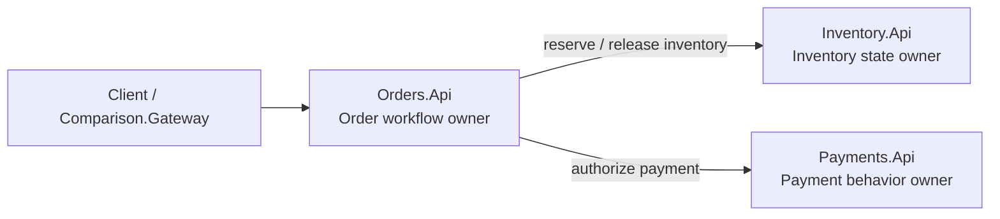
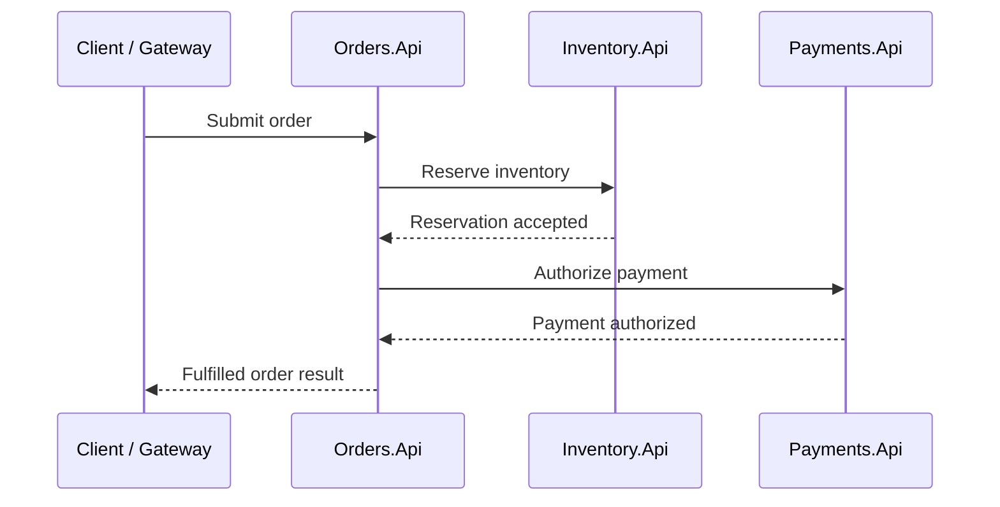
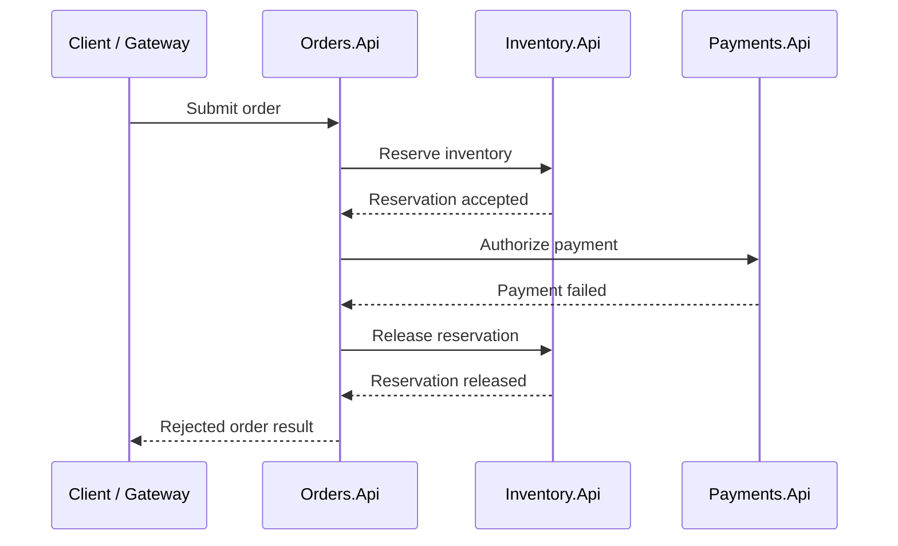

# Microservices design

The microservice-style implementation is split by deployable business capability:

- `Orders.Api`
- `Inventory.Api`
- `Payments.Api`

Each service owns its own data and exposes HTTP APIs for other services to call. The design makes service boundaries, deployment independence, explicit coordination, and operational surface area visible.

## Service topology

The important point is that `Orders.Api` coordinates the workflow, but it does not own inventory or payment state directly. Those responsibilities stay with the services that own the relevant business capability.

### Service responsibilities

#### Orders.Api

`Orders.Api` owns the order workflow.

It accepts order requests, coordinates inventory reservation, coordinates payment authorization, records the final order outcome, and returns the externally visible order result.

In this design, `Orders.Api` acts as the workflow orchestrator. It does not own inventory state or payment state directly. Instead, it asks the services that own those responsibilities to perform their part of the workflow.

### Inventory.Api

`Inventory.Api` owns product inventory state.

It is responsible for answering whether inventory is available, reserving inventory, releasing reserved inventory when compensation is required, and preventing over-reservation under concurrent requests.

The inventory service is the state boundary for the inventory invariant:

> Available inventory must not go below zero.

### Payments.Api

`Payments.Api` owns payment authorization behavior.

It simulates successful payment authorization, explicit payment failure, idempotent payment authorization responses, and timeout-related behavior used by the comparison scenarios.

The payment service is intentionally small, but it represents a common downstream dependency that can succeed, fail, or time out.

## Workflow shape

A successful order follows this general path:

A failed payment after reservation follows this general path:

This makes compensation explicit. `Orders.Api` coordinates the decision, but `Inventory.Api` still owns the inventory state transition.

## Concurrency model

The microservices implementation must protect state invariants explicitly at the service or persistence boundary.

For inventory, the important invariant is that completed orders must not exceed available stock. Under concurrent order submissions, `Inventory.Api` must ensure that only valid reservations are accepted and that remaining inventory does not become negative.

This is different from the virtual actor implementation, where per-identity serialization is part of the actor model. In the microservices design, concurrency protection is an explicit responsibility of the inventory service and its data access strategy.

## Idempotency model

Duplicate requests are handled by making idempotency state explicit.

`Orders.Api` owns the mapping between an idempotency key and the logical order result. Duplicate submissions should return the existing logical result instead of creating another order or reserving inventory again.

This is especially important when duplicate requests arrive concurrently, before the first request has completed.

## Failure handling

The microservices design makes failure paths visible because each service call can fail independently.

Examples:

- inventory can reject a reservation
- payment can fail after inventory was reserved
- payment can time out after inventory was reserved
- compensation can be required to release inventory
- duplicate requests can race on the same idempotency key

The sample keeps these policies deterministic so the architecture comparison remains easy to reason about.

## Deployment and operations

The microservice-style backend has multiple deployable processes:

- `Orders.Api`
- `Inventory.Api`
- `Payments.Api`

This makes independent deployment and independent scaling possible, but it also increases operational surface area.

Each service has its own configuration, logs, health checks, persistence concerns, and failure modes. Diagnosing one scenario run requires correlating activity across service boundaries, which is why the sample uses a correlation ID.

## Trade-offs highlighted by this design

The microservices implementation is useful for showing:

- explicit business capability boundaries
- independent deployable units
- explicit HTTP contracts
- service-owned data
- explicit workflow orchestration
- explicit compensation
- explicit idempotency handling
- operational complexity across multiple services

The design is intentionally small so these trade-offs remain visible without introducing unrelated production concerns.
