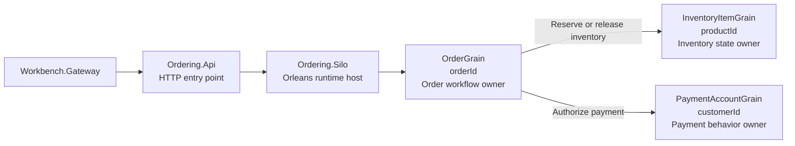
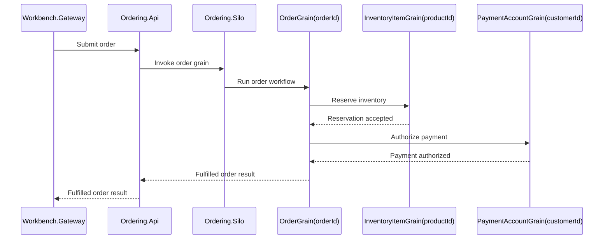
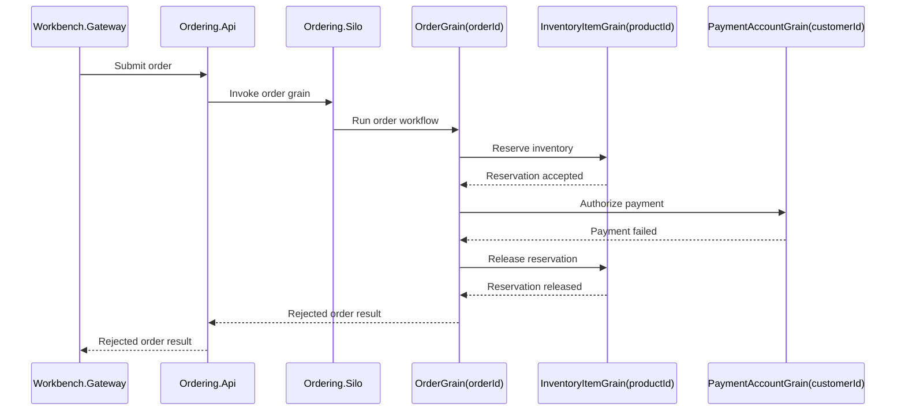

# Virtual actors design

The virtual actor-style implementation is organized around stateful identities rather than deployable business services.

The main actors are:

- `OrderGrain(orderId)`
- `InventoryItemGrain(productId)`
- `PaymentAccountGrain(customerId)`

The API exposes the same external order and inventory contracts used by the microservices implementation. Internally, workflow coordination moves from service-to-service HTTP calls to strongly typed grain calls.

## Actor topology

The important point is that state ownership is expressed through actor identity. `OrderGrain(orderId)` owns one logical order workflow, while `InventoryItemGrain(productId)` owns inventory for one product identity.

### Stateful identity boundaries

The workflow naturally contains stateful identities. Instead of splitting it primarily by deployable service capability, the virtual actor implementation asks:

- Which identity owns the order workflow?
- Which identity owns inventory for one product?
- Which identity owns payment behavior for one customer or account?
- Which operations must be serialized for a single identity?

This makes state ownership explicit at the actor identity boundary.

## Grain responsibilities

### `OrderGrain(orderId)`

`OrderGrain(orderId)` owns one logical order workflow. It coordinates inventory reservation, payment authorization, compensation, and the final order outcome for one order identity.

When the same logical order is submitted again, the order grain can return the stored result instead of executing the workflow again. Stable order identity therefore provides the basis for idempotent order processing.

### `InventoryItemGrain(productId)`

`InventoryItemGrain(productId)` owns inventory state for one product identity. It tracks available inventory, accepts valid reservations, rejects reservations when stock is insufficient, and releases reservations when compensation is required.

The inventory grain owns the inventory invariant:

> Available inventory must not fall below zero.

Orleans processes calls to a grain activation sequentially unless the grain is explicitly configured for reentrancy or interleaving. In this implementation, reservation attempts for the same product identity are therefore coordinated at that identity boundary. This differs from the microservices implementation, where concurrency control is implemented explicitly at the service and persistence boundary.

### `PaymentAccountGrain(customerId)`

`PaymentAccountGrain(customerId)` simulates payment authorization behavior for one customer or account identity. It models successful authorization, explicit payment failure, timeout-oriented behavior, and idempotent authorization outcomes for the sample scenarios.

The payment grain is intentionally small. Its purpose is to include payment behavior in the same stateful workflow comparison without introducing a real payment provider integration.

## Workflow shape

A successful order follows this general path:

A failed payment after reservation follows this general path:

The workflow remains coordinated inside the actor model while preserving distinct ownership boundaries for orders, inventory, and payment behavior.

## Concurrency model

The virtual actor implementation relies on per-identity serialization. Reservation attempts for the same product identity are routed to `InventoryItemGrain(productId)`, which owns that product's inventory state.

This supports invariants such as:

- completed orders must not exceed available stock
- remaining inventory must not become negative
- duplicate submissions for the same logical order must not create multiple unique orders

Per-identity serialization does not remove contention. A frequently accessed product can still become a hot grain, and throughput for that identity remains constrained by the work serialized through it. The actor model makes the contention boundary explicit rather than eliminating it.

## Idempotency model

Idempotency is modeled through stable workflow identity and persisted grain state.

`OrderGrain(orderId)` owns the logical order result. Duplicate submissions targeting the same order identity can return the existing result instead of reserving inventory and authorizing payment again.

`PaymentAccountGrain(customerId)` can retain authorization outcomes by idempotency key so repeated payment authorization attempts resolve consistently.

This differs from the microservices implementation, where `Orders.Api` coordinates idempotency explicitly through its persistence strategy and downstream request identity.

## Failure handling

The actor model provides state ownership and execution guarantees, but it does not choose business policy automatically. The implementation must still define what happens when:

- inventory is insufficient
- payment fails after inventory was reserved
- payment times out after inventory was reserved
- inventory must be released as compensation
- duplicate requests arrive while a workflow is in progress

The sample uses deterministic policies so both architecture implementations can be exercised through the same scenario expectations.

## Persistence

Grain state is persisted through `Ordering.Persistence.Sqlite`. Persistence allows order results, inventory state, and payment state to survive beyond one grain activation.

Persistent actor state introduces its own compatibility responsibilities. Changes to grain state must account for serialization, schema evolution, migrations, rollback, and the possibility that persisted state was written by an earlier application version.

## Hosting and operations

The virtual actor implementation contains:

- `Ordering.Api`, the HTTP entry point and Orleans client
- `Ordering.Grains`, the grain contracts, implementations, and state models
- `Ordering.Persistence.Sqlite`, the grain storage implementation
- `Ordering.Silo`, the standalone Orleans runtime host

The .NET Aspire AppHost composes these resources for local development, supplies service discovery and dependency wiring, and provides access to runtime logs, traces, metrics, health, and resource state through the Aspire dashboard.

Actor-specific operational concerns include:

- grain activation and placement
- Orleans client and silo connectivity
- hot grains and identity-level contention
- grain-state compatibility
- silo lifecycle and runtime behavior
- diagnostics correlated with actor identities

The external API remains intentionally similar to the microservices API so the comparison focuses on internal workflow and state ownership rather than client-facing contract differences.

## Trade-offs highlighted by this design

The virtual actor implementation highlights:

- stateful identity boundaries
- workflow ownership by order identity
- inventory ownership by product identity
- serialized execution per grain identity
- strongly typed grain calls
- persistent actor-state evolution
- hot-identity bottlenecks
- runtime-managed activation and placement
- dependence on Orleans runtime and silo operations

The design is intentionally small so these actor-model trade-offs remain visible without introducing unrelated production infrastructure.
