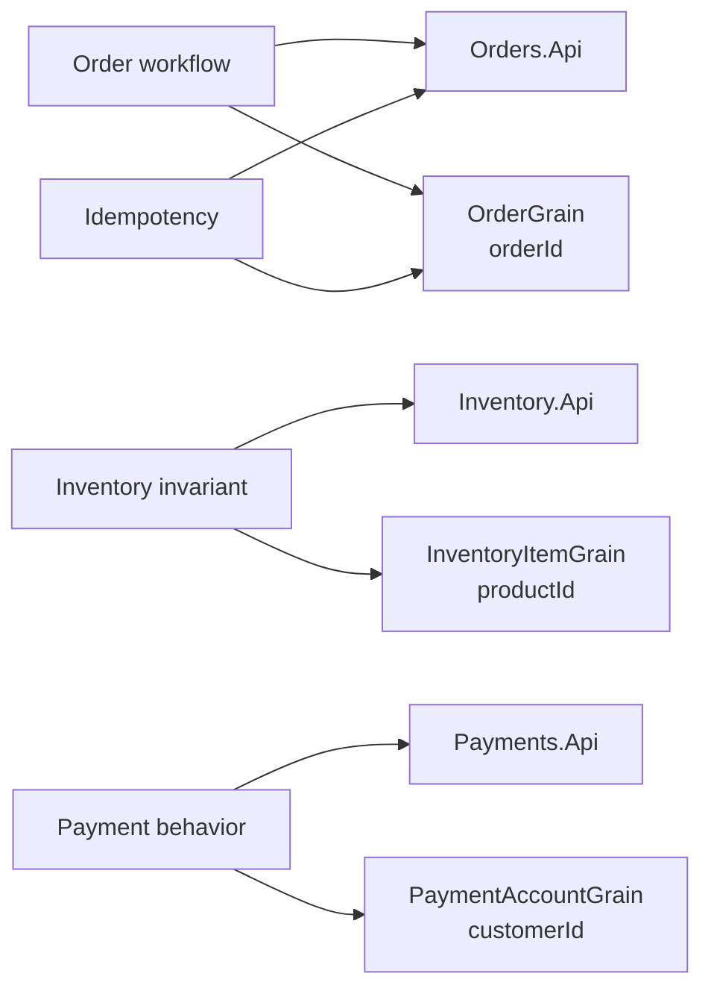

# Development comparison

This document compares the developer experience of implementing the same order workflow with two different architecture styles:

- a microservices-style implementation with explicit HTTP service boundaries
- a virtual actor-style implementation with stateful identity boundaries

The comparison focuses on how day-to-day development changes when state ownership, workflow coordination, concurrency, idempotency, and failure handling move to different places.

## Development focus

Microservices emphasize service contracts, HTTP communication, service-owned persistence, and explicit failure handling.

Virtual actors emphasize identity-based state, grain interfaces, runtime-managed activation, and per-entity coordination.

Both styles can express the same business workflow. The difference is where the developer has to make responsibilities explicit.

## Modeling the workflow

### Microservices

In the microservices implementation, the workflow is modeled across separately deployable services:

- `Orders.Api` coordinates the order workflow.
- `Inventory.Api` owns product inventory state.
- `Payments.Api` owns payment authorization behavior.

The developer has to design HTTP contracts between services, decide how each service persists its own data, and handle each downstream call as a possible failure point.

This makes service boundaries visible in code. It also means workflow logic can be spread across service entry points, client abstractions, DTOs, persistence models, and compensation paths.

### Virtual actors

In the virtual actor implementation, the workflow is modeled around stateful identities:

- `OrderGrain(orderId)` owns one order workflow.
- `InventoryItemGrain(productId)` owns inventory for one product identity.
- `PaymentAccountGrain(customerId)` owns payment behavior for one customer or account identity.

The developer works with grain interfaces and strongly typed method calls instead of internal HTTP calls between workflow participants.

This can make identity-specific state and behavior easier to reason about, but it also means grain boundaries, grain state shape, activation behavior, and runtime assumptions become part of the design.

## State ownership

State ownership is the central development difference.

In the microservices implementation, state ownership is expressed through services and their data stores. `Inventory.Api` owns inventory. `Orders.Api` owns order records and idempotency behavior. `Payments.Api` owns payment attempts.

In the virtual actor implementation, state ownership is expressed through actor identity. `InventoryItemGrain(productId)` owns one product inventory identity. `OrderGrain(orderId)` owns one logical order workflow identity.

The developer has to answer the same questions in both designs:

- Who owns the state?
- Who is allowed to change the state?
- Who protects the invariant?
- Who records the final result?
- Who handles duplicate requests?

The implementation style changes where those answers appear in code.

## Coordination style

### Microservices coordination

The microservices implementation coordinates the workflow through HTTP calls.

A typical order flow requires `Orders.Api` to call `Inventory.Api`, then call `Payments.Api`, then possibly call `Inventory.Api` again to release a reservation when compensation is required.

This makes integration boundaries explicit. It also requires developers to handle:

- HTTP status codes
- serialization contracts
- downstream timeouts
- retries or retry avoidance
- partial failure
- compensation
- correlation across service logs

### Virtual actor coordination

The virtual actor implementation coordinates the workflow through grain calls.

A typical order flow requires `OrderGrain` to call `InventoryItemGrain`, then call `PaymentAccountGrain`, then possibly call `InventoryItemGrain` again to release a reservation.

This can make the workflow read more like direct domain collaboration. However, developers still need to understand:

- grain identity selection
- activation and placement behavior
- serialized execution per grain identity
- grain state compatibility
- runtime failure behavior
- hot grain bottlenecks

The actor model changes the coordination mechanism, but it does not remove the need to design the workflow carefully.

## Concurrency and invariants

### Microservices

In the microservices implementation, concurrency protection must be explicit at the state owner.

For inventory, `Inventory.Api` must ensure that concurrent reservations do not reduce available inventory below zero. This is a service and persistence design responsibility.

The benefit is that the concurrency strategy is visible and can be implemented using familiar service and database techniques. The cost is that the developer must design, test, and maintain that strategy explicitly.

### Virtual actors

In the virtual actor implementation, concurrency protection is naturally aligned with actor identity.

All reservation attempts for one product identity are routed through `InventoryItemGrain(productId)`. Calls for that grain identity are processed sequentially by the actor runtime, which helps protect the inventory invariant for that identity.

The benefit is that single-identity invariants can be easier to express. The cost is that hot identities can become bottlenecks, and developers must understand runtime behavior when designing for scale.

## Idempotency

Idempotency is a first-class development concern in both implementations.

In the microservices implementation, `Orders.Api` must explicitly protect the relationship between an idempotency key and a logical order result. Duplicate submissions should return the existing result instead of creating a second order or reserving inventory again.

In the virtual actor implementation, `OrderGrain(orderId)` can use stable actor identity and stored grain state to return the existing result for duplicate submissions targeting the same logical order.

Both approaches still require clear semantics. Developers must decide what counts as a duplicate request, how long idempotency state is retained, and what response duplicate submissions should receive.

## Failure handling and compensation

Failure handling is explicit in both styles.

The sample includes scenarios where inventory is insufficient, payment fails after reservation, and payment times out after reservation.

In the microservices implementation, failure handling is expressed through HTTP responses, service client behavior, and compensation calls between services.

In the virtual actor implementation, failure handling is expressed through grain method results, workflow state transitions, and compensation calls between grains.

The architecture style changes the mechanics, but the business policy still has to be designed:

- Should a timeout reject the order?
- Should a timeout move the order to a pending state?
- Should inventory be released immediately?
- Should payment be retried?
- What should the final reason be?

The sample keeps these decisions deterministic so both implementations can be compared with the same scenario expectations.

## Testing implications

### Microservices tests

Microservices tests tend to focus on service contracts, HTTP-facing behavior, downstream client behavior, persistence behavior, and compensation paths.

Useful tests include:

- order workflow tests through `Orders.Api`
- fake downstream inventory and payment clients
- idempotency race tests
- compensation tests
- scenario regression tests through the comparison layer

### Virtual actor tests

Virtual actor tests tend to focus on grain behavior, identity-specific state, serialized execution, and workflow coordination through grains.

Useful tests include:

- grain workflow tests with an Orleans test cluster
- inventory grain concurrency tests
- order grain idempotency tests
- payment grain behavior tests
- scenario regression tests through the comparison layer

Both styles need regression tests that protect scenario semantics, not just method signatures.

## Developer trade-offs

The microservices style can be easier to understand when teams think in deployable business capabilities. It makes service boundaries explicit and keeps service ownership visible. The trade-off is that more workflow behavior crosses process, network, contract, and persistence boundaries.

The virtual actor style can be easier to understand when the domain is naturally partitioned by stateful identity. It colocates state and behavior for one identity and can simplify single-identity concurrency. The trade-off is that actor runtime behavior, grain identity design, and state evolution become central development concerns.

Neither style removes complexity. Each style moves complexity to a different set of boundaries.

## Practical takeaway

For developers, the important comparison is not which implementation has fewer files or fewer lines of code.

The important comparison is where the hard parts live:

- Microservices place the hard parts around service contracts, persistence boundaries, network calls, explicit concurrency control, and compensation.
- Virtual actors place the hard parts around actor identity, grain state, runtime behavior, hot identities, and interface/state compatibility.

The same workflow can be implemented correctly in both styles. The value of the comparison is seeing how the development model changes when the ownership boundary changes.
