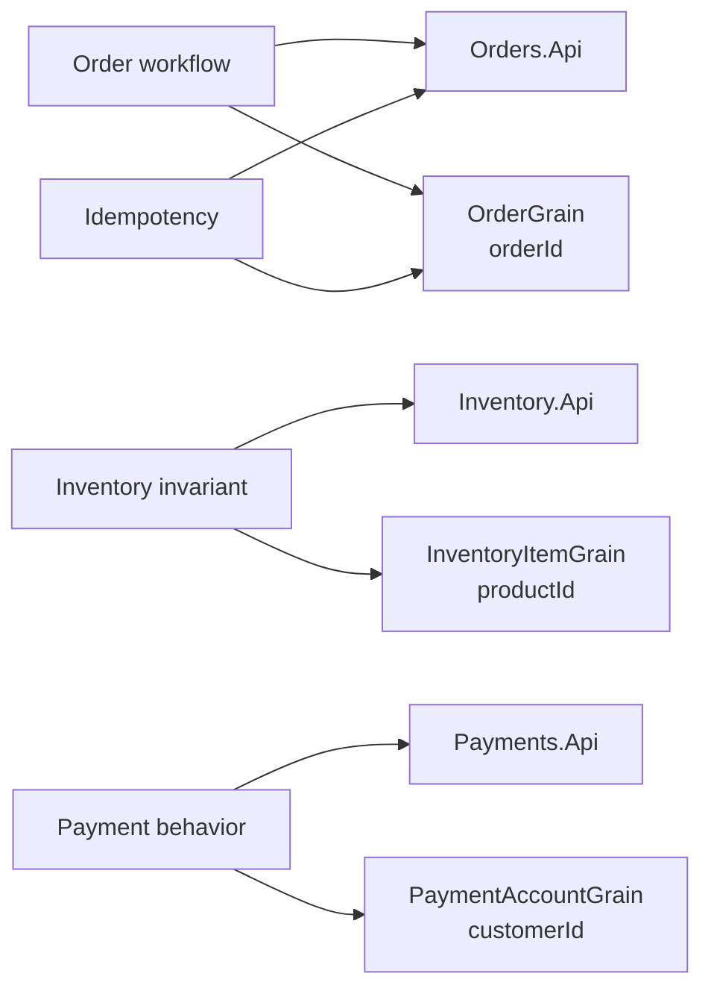

# Development comparison

This document compares the developer experience of implementing the same order workflow in two architectural styles:

- a microservices-style implementation with explicit HTTP service boundaries
- a virtual actor-style implementation with stateful identity boundaries

The comparison focuses on where developers express state ownership, workflow coordination, concurrency control, idempotency, failure handling, testing, and operational diagnostics.

## Development focus

Microservices emphasize service contracts, HTTP communication, service-owned persistence, and explicit handling of remote failures.

Virtual actors emphasize identity-based state, grain interfaces, runtime-managed activation, and per-identity coordination.

Both styles can implement the same business workflow. The difference is where responsibilities become explicit in code and which runtime assumptions developers must understand.

## Modeling the workflow

### Microservices

In the microservices implementation, the workflow is modeled across independently hosted services:

- `Orders.Api` coordinates the order workflow
- `Inventory.Api` owns product inventory state
- `Payments.Api` owns payment authorization behavior

Developers define HTTP contracts between services, decide how each service persists its data, and treat each downstream call as a possible failure point.

This makes process and service boundaries visible in code. It can also distribute workflow behavior across endpoints, client abstractions, transport contracts, persistence models, retries, and compensation paths.

### Virtual actors

In the virtual actor implementation, the workflow is modeled around stateful identities:

- `OrderGrain(orderId)` owns one order workflow
- `InventoryItemGrain(productId)` owns inventory for one product identity
- `PaymentAccountGrain(customerId)` owns payment behavior for one customer or account identity

Developers work with grain interfaces and strongly typed asynchronous calls rather than directly constructing HTTP requests between workflow participants. Orleans still treats grain calls as distributed messages when required, including copying or serializing their arguments and results.

This can make identity-specific state and behavior easier to follow. It also makes grain identity, state shape, activation, placement, serialization, and runtime scheduling part of the development model.

## State ownership

State ownership is the central development difference.

In the microservices implementation, ownership is expressed through services and their data stores:

- `Inventory.Api` owns inventory and reservations
- `Orders.Api` owns order records and order idempotency
- `Payments.Api` owns payment attempts

In the virtual actor implementation, ownership is expressed through actor identity:

- `InventoryItemGrain(productId)` owns one product inventory identity
- `OrderGrain(orderId)` owns one logical order workflow identity
- `PaymentAccountGrain(customerId)` owns payment behavior for one customer identity

Developers must answer the same questions in both designs:

- Who owns the state?
- Who may change it?
- Who protects the invariant?
- Who records the terminal result?
- Who recognizes and resolves duplicate requests?

The architecture changes where those answers appear and how they are enforced.

## Coordination style

### Microservices coordination

The microservices implementation coordinates the workflow through HTTP calls. A typical order flow requires `Orders.Api` to reserve inventory through `Inventory.Api`, authorize payment through `Payments.Api`, and possibly call `Inventory.Api` again to release the reservation.

Developers must account for:

- HTTP status codes and response bodies
- serialization contracts
- downstream timeouts
- retry safety and retry avoidance
- partial failure
- compensation
- correlation across service logs and traces

These concerns are explicit because every service call crosses a remote boundary.

### Virtual actor coordination

The virtual actor implementation coordinates the workflow through grain calls. A typical order flow requires `OrderGrain` to call `InventoryItemGrain`, then `PaymentAccountGrain`, and possibly `InventoryItemGrain` again to release a reservation.

The code can read like direct domain collaboration, but developers still need to understand:

- grain identity selection
- activation and placement behavior
- request scheduling and interleaving
- grain-call and grain-state serialization
- state compatibility
- runtime and silo failure behavior
- hot-grain bottlenecks

The actor model changes the programming abstraction and coordination boundary. It does not turn remote work into an in-process method call or remove distributed-system failure modes.

## Concurrency and invariants

### Microservices

In the microservices implementation, concurrency protection must be explicit at the state owner. `Inventory.Api` must ensure that concurrent reservations do not reduce available inventory below zero.

The concurrency strategy is visible and can use familiar service and database techniques. The developer is responsible for choosing, testing, and maintaining the strategy, including its behavior under retries and competing requests.

### Virtual actors

In the virtual actor implementation, concurrency protection aligns with actor identity. Reservation attempts for one product identity are routed to `InventoryItemGrain(productId)`.

Orleans grain activations use a single-threaded execution model and, by default, process one request to completion before processing the next. Reentrancy and interleaving can change that behavior, so the guarantee must be considered together with the grain configuration.

This can simplify single-identity invariants. It does not remove contention: a hot product can become a hot grain, and throughput for that identity remains bounded by the work serialized through it.

## Idempotency

Idempotency is a first-class development concern in both implementations.

In the microservices implementation, `Orders.Api` explicitly protects the relationship between an idempotency key and a logical order result. Duplicate submissions should return the established result instead of creating another order or reserving inventory again.

In the virtual actor implementation, `OrderGrain(orderId)` combines stable actor identity with persisted grain state. Duplicate submissions targeting the same order identity can return the stored result instead of rerunning the workflow.

Both designs still require clear policy:

- What identifies the same logical request?
- What happens when duplicates arrive concurrently?
- How long is the idempotent result retained?
- Can a key be reused with different request data?
- What response is returned for an established result?

The architecture can support idempotency, but it does not define those semantics automatically.

## Failure handling and compensation

Failure handling remains explicit in both styles. The sample includes insufficient inventory, payment failure after reservation, and payment timeout after reservation.

In the microservices implementation, failure handling is expressed through HTTP outcomes, service-client behavior, persisted workflow state, and compensation calls between services.

In the virtual actor implementation, it is expressed through grain-call outcomes, persisted grain state, workflow transitions, and compensation calls between grains.

The business policy still has to answer:

- Does a timeout reject the order or leave it pending?
- Is inventory released immediately?
- Is payment retried?
- How is an ambiguous downstream outcome reconciled?
- What terminal reason is exposed to the caller?

The workbench uses deterministic policies so both implementations can be compared through the same scenario expectations. Those policies are intentionally simpler than a production recovery and reconciliation model.

## Testing implications

### Microservices tests

Microservices tests focus on service contracts, endpoint behavior, downstream-client behavior, persistence, concurrency, idempotency, and compensation.

The repository includes coverage for:

- order workflow behavior through `Orders.Api`
- controlled inventory and payment clients
- persistence-backed state transitions
- compensation paths
- gateway acceptance behavior
- normalized scenario regression semantics

### Virtual actor tests

Virtual actor tests focus on grain behavior, stable identities, persisted grain state, request scheduling, and workflow coordination through grains.

The repository includes coverage for:

- order workflow behavior in an Orleans test cluster
- SQLite grain persistence
- inventory and order state behavior
- gateway acceptance behavior
- normalized scenario regression semantics

Both styles need tests that protect observable scenario semantics, not only method signatures or individual implementation classes.

## Debugging and diagnostics

The development workflow uses the .NET Aspire AppHost to start and connect the complete application topology.

The Aspire dashboard provides detailed development diagnostics that are not reproduced in the Workbench UI, including:

- resource state and endpoints
- structured logs
- distributed traces
- metrics
- dependency and lifecycle information

The Workbench UI provides the comparison-specific view:

- normalized scenario outcomes
- explanatory event timelines
- evaluated health organized by topology
- a static architecture topology explanation
- concise trade-off guidance

The two dashboards are complementary. Developers use the Workbench to understand comparison semantics and the Aspire dashboard to investigate lower-level runtime behavior.

## Developer trade-offs

The microservices style can be easier to understand when teams organize work around deployable business capabilities. Service ownership is visible, and each boundary can evolve independently. The cost is that more workflow behavior crosses network, contract, persistence, and operational boundaries.

The virtual actor style can be easier to understand when the domain is naturally partitioned by durable identities. State and behavior for one identity are colocated, and single-identity coordination can be simpler. The cost is that actor identity design, request scheduling, runtime behavior, serialization, and state evolution become central development concerns.

Neither style removes complexity. Each style moves complexity to a different set of boundaries.

## Practical takeaway

The useful development comparison is not which implementation has fewer files or lines of code. It is where the difficult responsibilities live:

- Microservices place them around service contracts, persistence boundaries, remote calls, explicit concurrency control, and compensation
- Virtual actors place them around actor identity, grain state, request scheduling, runtime behavior, hot identities, and interface and state compatibility

The same workflow can be implemented correctly in both styles. The value of the workbench is seeing how the development model changes when the ownership boundary changes.
