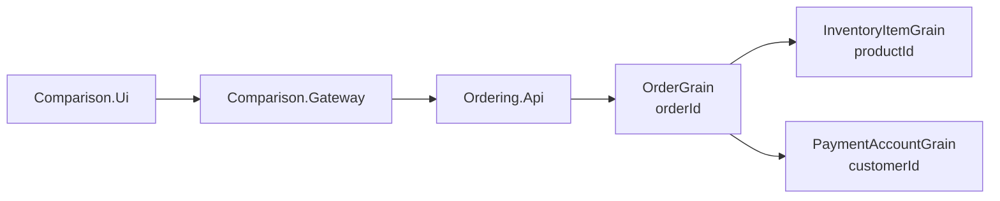
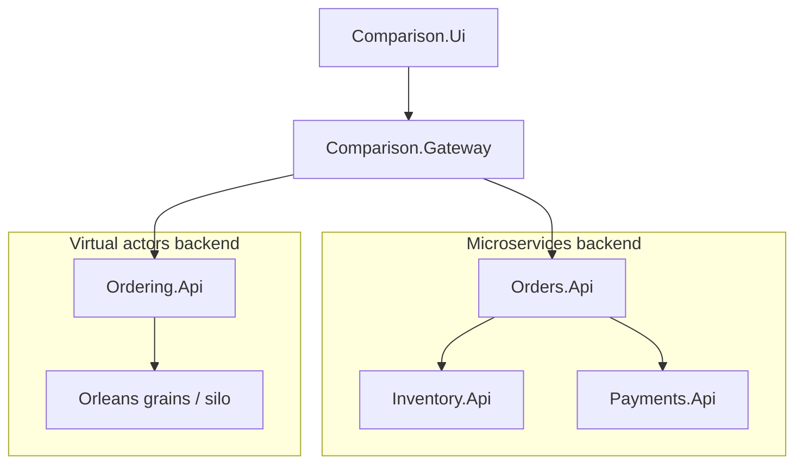

# Deployment comparison

The deployment shapes are intentionally different because the two implementations place ownership and coordination at different boundaries.

The microservices implementation is deployed as multiple backend services that communicate through HTTP. The virtual actor implementation is deployed as an Orleans-based backend where workflow coordination happens through grain calls and stateful actor identities.

This document compares the deployment and operational shape of both approaches. It is not a production deployment guide and it is not a performance benchmark.

## Microservices deployment

The microservice-style backend has three main deployable processes:

- `Orders.Api`
- `Inventory.Api`
- `Payments.Api`

`Orders.Api` coordinates the workflow by calling `Inventory.Api` and `Payments.Api`. Each service can be deployed, configured, monitored, restarted, and scaled separately.

## Microservices topology

A typical local microservices topology looks like this:

```text
Comparison.Ui
  -> Comparison.Gateway
      -> Orders.Api
          -> Inventory.Api
          -> Payments.Api
```

`Orders.Api` is the workflow entry point for the microservices backend. It owns order workflow coordination but does not own inventory or payment state directly.

`Inventory.Api` owns product inventory state and protects inventory invariants.

`Payments.Api` owns payment authorization behavior used by the comparison scenarios.

## Microservices operational characteristics

The microservices deployment makes service boundaries visible at runtime.

Each service has its own process, configuration, logs, health checks, persistence concerns, and failure modes. This makes independent deployment possible, but it also increases the number of moving parts that must be operated together.

Operational diagnosis usually requires following a scenario across multiple processes. A single order scenario can produce relevant logs in the gateway, orders service, inventory service, and payments service. This is why correlation IDs are important in the sample.

## Microservices scaling model

The microservices style allows services to be scaled independently.

For example:

- `Orders.Api` can be scaled when workflow request volume increases.
- `Inventory.Api` can be scaled or tuned around inventory contention and persistence behavior.
- `Payments.Api` can be scaled separately when payment authorization behavior becomes the bottleneck.

However, independent scaling does not remove workflow coupling. The order workflow still depends on downstream inventory and payment calls. If one required service is unavailable, slow, or misconfigured, the workflow is affected.

## Microservices failure model

The microservices deployment has explicit network and process boundaries.

The implementation must handle failures such as:

- `Inventory.Api` rejecting a reservation
- `Payments.Api` failing authorization
- `Payments.Api` timing out after inventory was reserved
- service restarts during a workflow
- configuration mismatches between services
- duplicate submissions arriving concurrently

Compensation and idempotency are explicit design responsibilities. `Orders.Api` coordinates the workflow, but `Inventory.Api` still owns the inventory state transition.

## Local microservices run

The microservices backend can be run with Docker Compose:

```powershell
docker compose -f deploy/microservices/docker-compose.yml up --build
```

When running from Visual Studio, configure the required microservices projects as startup projects instead of using Docker Compose.

## Microservices trade-offs

### Advantages

- Independent service deployment
- Clear service ownership boundaries
- Explicit HTTP APIs
- Familiar process and service model
- Services can be configured and scaled separately
- Operational responsibility maps naturally to service boundaries

### Costs

- More deployable units
- More network paths
- More configuration
- More health checks and logs to correlate
- More failure modes between workflow participants
- Workflow consistency requires explicit compensation and idempotency

## Virtual actors deployment

The virtual actor-style backend exposes an HTTP API through `Ordering.Api` and coordinates the workflow through Orleans grains.

The main actor identities are:

- `OrderGrain(orderId)`
- `InventoryItemGrain(productId)`
- `PaymentAccountGrain(customerId)`

The deployment shape is different because coordination moves from service-to-service HTTP calls to grain calls inside the Orleans runtime.

## Virtual actors topology

A typical local virtual actor topology looks like this:

```text
Comparison.Ui
  -> Comparison.Gateway
      -> Ordering.Api
          -> OrderGrain(orderId)
              -> InventoryItemGrain(productId)
              -> PaymentAccountGrain(customerId)
```

`Ordering.Api` is the HTTP entry point for the virtual actor backend.

The grains own stateful identities and coordinate the workflow internally through strongly typed grain calls.

Depending on the local run mode, Orleans may be hosted in-process by `Ordering.Api` or through a standalone `Ordering.Silo` process. The important comparison point is that the workflow is coordinated by actor identities rather than by HTTP calls across multiple business services.




## Virtual actors operational characteristics

The virtual actor deployment has fewer explicit business-service processes, but the Orleans runtime becomes part of the operational model.

Operational diagnosis focuses on actor identities, grain activation, runtime behavior, state persistence, placement, and hot grains.

A scenario may still need correlation across the gateway, API process, and actor runtime logs. The boundaries are different from the microservices version, but observability remains necessary.

## Virtual actors scaling model

The virtual actor model scales around actor identities and Orleans runtime behavior.

For example:

- order workflow state is partitioned by `orderId`
- inventory state is partitioned by `productId`
- payment behavior is partitioned by `customerId`

This can be a natural fit when the domain is already identity-oriented. However, hot identities can still become bottlenecks. A product with very high contention can concentrate work around one `InventoryItemGrain(productId)`.

Scaling therefore depends on grain placement, persistence strategy, cluster configuration, and the distribution of actor identities.

## Virtual actors failure model

The virtual actor implementation still needs explicit failure policies.

The actor runtime helps with activation and identity routing, but it does not remove business failure cases. The implementation must still define what happens when:

- inventory is insufficient
- payment fails after inventory was reserved
- payment times out after inventory was reserved
- compensation must release inventory
- duplicate submissions target the same order identity
- a grain or silo restarts during operation

The deployment model changes where failures appear, but it does not remove the need for deterministic workflow behavior.

## Local virtual actors run

The virtual actor backend can be run with Docker Compose:

```powershell
docker compose -f deploy/virtual-actors/docker-compose.yml up --build
```

When running from Visual Studio, configure the required virtual actor projects as startup projects instead of using Docker Compose.

## Virtual actors trade-offs

### Advantages

- Workflow is modeled around stateful identities
- Per-product inventory coordination is localized in `InventoryItemGrain(productId)`
- Fewer explicit service-to-service HTTP calls in application code
- Actor runtime manages activation and placement
- Single-identity concurrency can be easier to reason about
- Domain state and behavior can be colocated by identity

### Costs

- Orleans runtime behavior becomes part of the operational model
- Hot grains can become bottlenecks
- Persistence and clustering choices matter
- Grain state compatibility becomes important during evolution
- Deployment independence differs from microservice-style service boundaries
- Developers and operators must understand actor runtime concepts

## Full comparison stack

The full comparison stack includes:

- `Comparison.Ui`
- `Comparison.Gateway`
- the microservices backend
- the virtual actor backend

It can be run with Docker Compose:

```powershell
docker compose -f deploy/docker-compose.full.yml up --build
```

For local development in Visual Studio, the same stack can be run by configuring multiple startup projects. This is a valid development flow and keeps each project visible in the Visual Studio output and debugging experience.




## Comparison summary

The microservices deployment emphasizes independently deployable business services. This makes service ownership and operational boundaries explicit, but increases the number of processes, network paths, and failure points.

The virtual actor deployment emphasizes stateful identity boundaries. This can simplify workflow coordination for identity-oriented state, but makes the actor runtime, grain placement, hot identities, and grain state evolution central operational concerns.

Neither deployment style removes distributed-systems complexity. Each style moves the complexity to different boundaries.
