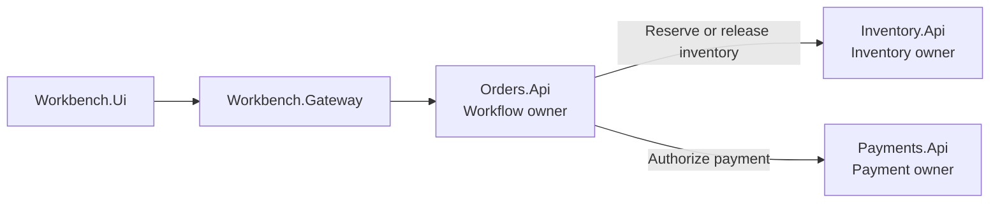
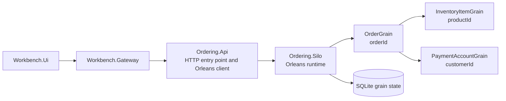
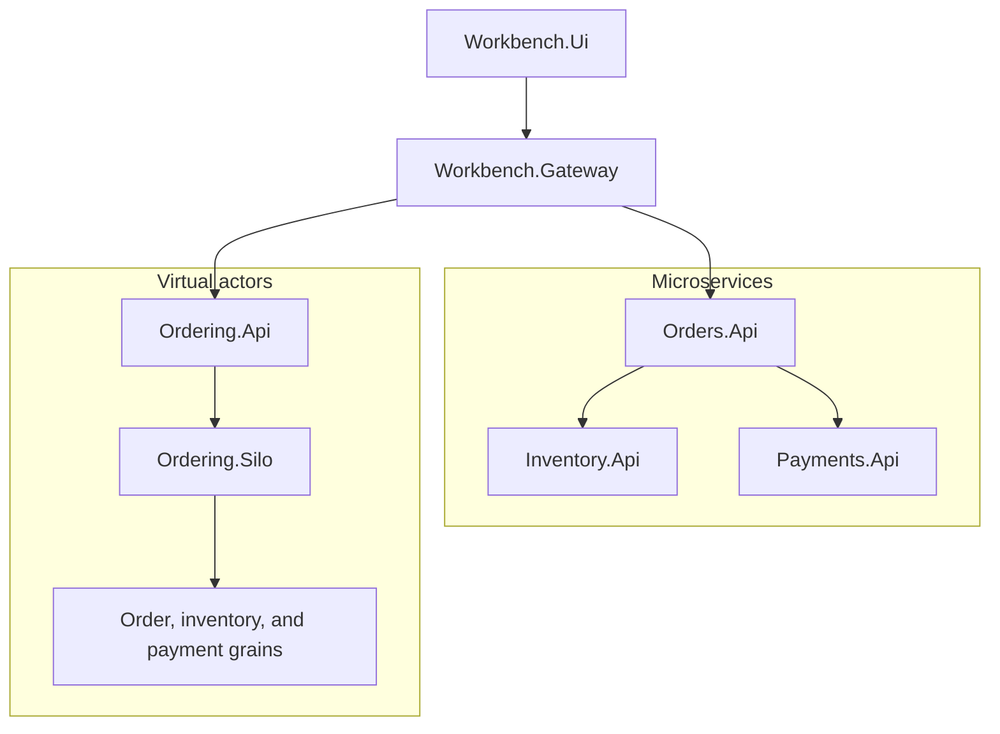

# Deployment comparison

The two implementations have intentionally different runtime shapes because they place ownership and coordination at different boundaries.

- The microservices implementation runs as multiple HTTP services with independent data ownership
- The virtual actor implementation runs as an HTTP API plus an Orleans silo that hosts stateful grain identities

This document compares their deployment and operational characteristics. It is not a production deployment guide and does not claim that either topology is universally preferable.

For local development, the repository uses the .NET Aspire AppHost to compose both implementations, the Workbench, health resources, service discovery, and observability.

## Microservices deployment

The microservices backend has three primary runtime processes:

- `Orders.Api`
- `Inventory.Api`
- `Payments.Api`

`Orders.Api` coordinates the workflow by calling `Inventory.Api` and `Payments.Api`. Each service can be configured, monitored, restarted, deployed, and scaled separately, although the order workflow still depends on the required downstream services.

### Runtime topology

`Orders.Api` is the workflow entry point for the microservices backend. It owns order coordination but does not own inventory or payment state. `Inventory.Api` protects inventory invariants, while `Payments.Api` owns payment authorization outcomes.

### Operational characteristics

The service boundaries remain visible at runtime. Each API has its own:

- process lifecycle
- configuration
- HTTP endpoints
- structured logs
- traces and metrics
- readiness and liveness state
- SQLite persistence boundary
- compatibility and failure concerns

Diagnosing one order can require following activity through `Workbench.Gateway`, `Orders.Api`, `Inventory.Api`, and `Payments.Api`. Correlation and distributed tracing are therefore part of the development and operational model rather than optional presentation detail.

### Scaling characteristics

The services can be scaled independently when their workloads differ:

- `Orders.Api` can scale with order-workflow request volume
- `Inventory.Api` can be tuned around persistence behavior and inventory contention
- `Payments.Api` can scale around authorization demand

Independent scaling does not remove workflow coupling or state contention. The order path still depends on inventory and payment calls, and a hot product remains constrained by the consistency boundary that protects its inventory.

See [Scaling comparison](06-scaling-comparison.md) for the broader analysis.

### Failure characteristics

The microservices topology contains explicit network and process boundaries. The implementation must account for cases such as:

- inventory rejection
- payment failure after reservation
- payment timeout after reservation
- downstream unavailability or latency
- service restart during a workflow
- configuration or contract mismatch
- concurrent duplicate submissions
- compensation failure or an ambiguous downstream outcome

Compensation and idempotency are explicit design responsibilities. `Orders.Api` coordinates the workflow decision, while each downstream service remains responsible for its own state transition.

### Trade-offs

#### Advantages

- Independent service deployment
- Clear business-capability ownership
- Explicit HTTP contracts
- Service-owned data
- Independent configuration and scaling
- Operational responsibility aligned with service boundaries

#### Costs

- More deployable units and network paths
- More configuration and compatibility boundaries
- More health, logging, tracing, and metric data to correlate
- More partial-failure modes
- Explicit compensation and idempotency requirements
- Distributed workflow consistency across independently owned state

## Virtual actors deployment

The virtual actor backend has two primary runtime processes:

- `Ordering.Api` exposes the HTTP entry point and acts as an Orleans client
- `Ordering.Silo` hosts the Orleans runtime and grain activations

The stateful workflow is implemented by these grain identities:

- `OrderGrain(orderId)`
- `InventoryItemGrain(productId)`
- `PaymentAccountGrain(customerId)`

`Ordering.Persistence.Sqlite` provides the silo's grain-state persistence implementation. It is a library used by the silo, not a separate runtime process.

### Runtime topology

The workflow is coordinated through strongly typed grain calls rather than business-service HTTP calls. Grain identities own state and behavior, while Orleans provides activation, identity routing, placement, and per-activation request scheduling.

### Operational characteristics

The virtual actor deployment has fewer explicit business-service processes, but the Orleans runtime becomes a first-class operational dependency. Diagnosis may involve:

- the API-to-cluster connection
- silo startup and membership
- grain activation and placement
- grain identity and hot-identity behavior
- grain-state persistence
- runtime logs, traces, and metrics
- compatibility of grain interfaces and persisted state

A scenario still crosses `Workbench.Gateway`, `Ordering.Api`, and `Ordering.Silo`. The boundaries differ from the microservices topology, but correlation and observability remain necessary.

### Scaling characteristics

The actor model partitions work around stable identities:

- order workflow state by `orderId`
- inventory state by `productId`
- payment behavior by `customerId`

This can align naturally with an identity-oriented domain. It does not eliminate hot spots. High contention for one product concentrates work on one `InventoryItemGrain(productId)`, so throughput remains constrained by the consistency requirements of that identity.

Scaling depends on silo capacity, grain placement, persistence performance, cluster configuration, and the distribution of actor identities.

### Failure characteristics

Orleans helps with activation and identity routing, but it does not define the business failure policy. The implementation must still decide what happens when:

- inventory is insufficient
- payment fails or times out after reservation
- compensation must release inventory
- duplicate submissions target one order identity
- a silo or grain activation restarts during operation
- persistence is unavailable or incompatible
- API-to-cluster communication is interrupted

The runtime changes where failures appear and how stateful work is addressed. It does not remove the need for deterministic workflow behavior, idempotency, reconciliation decisions, and state compatibility.

### Trade-offs

#### Advantages

- Workflow modeled around stateful identities
- State and behavior colocated by identity
- Per-identity execution easier to reason about
- Fewer business-service HTTP calls in application code
- Runtime-managed activation, routing, and placement
- Natural partitioning for identity-oriented workloads

#### Costs

- Orleans runtime and cluster behavior become operational concerns
- Hot grains can limit throughput
- Silo capacity, placement, and persistence choices matter
- Grain interface and state compatibility require care
- Deployment boundaries do not map directly to business capabilities
- Developers and operators need actor-runtime knowledge

## Development composition with Aspire

The .NET Aspire AppHost is the supported development composition for the complete repository. It starts and connects:

- `Workbench.Ui`
- `Workbench.Gateway`
- the three microservices APIs
- `Ordering.Api`
- `Ordering.Silo`
- health groups and topology metadata
- shared observability configuration

Aspire provides the development orchestration and service-discovery experience, but it is more than a launcher. The Aspire dashboard exposes resource state, dependencies, endpoints, structured logs, distributed traces, metrics, configuration, and lifecycle operations that are intentionally not duplicated in `Workbench.Ui`.

The dashboards are complementary:

- `Workbench.Ui` presents curated scenario outcomes, architecture comparison, health interpretation, topology explanation, and trade-offs
- The Aspire dashboard provides lower-level development diagnostics across the complete composed application

The AppHost is not presented as the production deployment model. A production deployment would require independent decisions for hosting, networking, security, persistence, scaling, telemetry storage, release management, and recovery.

## Health and readiness

Both topologies use the shared service defaults:

- `/health` represents readiness and can include dependency or persistence checks
- `/alive` represents process liveness

The AppHost uses health information to represent resource state and startup dependencies. The Workbench Health page combines live reports with the shared topology model to present architecture groups, nodes, dependency health, and resource availability.

Health does not prove workflow correctness. A ready process can still return an incorrect business result, violate an idempotency rule, or fail a compensation path. Scenario validation and health evaluation answer different questions.

See [Observability and operations](16-observability-and-operations.md) for the detailed model.

## Release and compatibility implications

The deployment boundaries create different compatibility concerns.

For microservices:

- HTTP contracts must remain compatible across independently updated services
- database changes belong to the service that owns the data
- rollout order can matter when callers and dependencies change together

For virtual actors:

- `Ordering.Api` and `Ordering.Silo` must remain compatible as Orleans client and cluster participants
- grain interfaces must remain compatible across runtime updates
- persisted grain state and storage schema changes require deliberate evolution
- mixed-version cluster behavior must be understood before staged rollout

Neither style makes rollback automatic. A safe rollback depends on contract compatibility, persisted-state compatibility, and whether the failed version has already changed durable data.

See [Release, versioning, and rollback](14-release-versioning-and-rollback.md) for detailed guidance.

## Comparison summary

The microservices deployment emphasizes independently deployable business services. This makes capability ownership and service boundaries explicit, while increasing the number of processes, network paths, compatibility edges, and independently observable failure points.

The virtual actor deployment emphasizes stateful identity boundaries. This can simplify coordination for identity-oriented state, while making the Orleans runtime, cluster behavior, hot identities, and grain-state evolution central operational concerns.

Neither deployment style removes distributed-systems complexity. Each places that complexity at different boundaries.

## Related documentation

- [Microservices design](02-microservices-design.md)
- [Virtual actors design](03-virtual-actors-design.md)
- [Development comparison](04-development-comparison.md)
- [Scaling comparison](06-scaling-comparison.md)
- [Trade-offs](07-tradeoffs.md)
- [Local validation](09-local-validation.md)
- [Observability and operations](16-observability-and-operations.md)
- [Known limitations](17-known-limitations.md)
- [Out of scope](18-out-of-scope.md)
