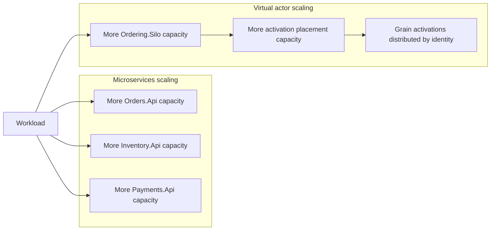

# Scaling comparison

The two implementations scale along different primary axes.

Microservices add capacity at explicit service boundaries. Virtual actors add Orleans cluster capacity and distribute grain activations across silos.

Both approaches can scale horizontally, but neither scales every workload automatically. The useful question is whether added capacity reaches the actual bottleneck.

This document compares scaling characteristics. It is not a benchmark and does not claim universal throughput, latency, or cost advantages.

## Scaling axes

The diagram shows the primary scaling boundary, not a complete production topology.

## Microservices scaling

Microservices scale by adding capacity to independently hosted service boundaries:

- more `Orders.Api` instances add workflow entry-point capacity
- more `Inventory.Api` instances add inventory API capacity
- more `Payments.Api` instances add payment authorization capacity

This allows services with different load profiles to be scaled independently. It does not guarantee higher end-to-end throughput, because the limiting resource may be a database row, a lock, a downstream dependency, a network path, or one hot business identity.

### State consistency under multiple instances

Adding service instances does not change the ownership of state or the invariants that must be protected.

If multiple `Inventory.Api` instances accept reservation requests, correctness still depends on the inventory service and persistence strategy enforcing the central invariant:

> Completed reservations must never reduce available inventory below zero.

The concurrency mechanism must remain correct regardless of how many API instances are running. Adding process capacity can increase pressure on the same persistence boundary and may expose contention that was less visible with one instance.

### Microservices bottlenecks

Potential bottlenecks include:

- the `Orders.Api` workflow coordinator
- the `Inventory.Api` reservation path
- the inventory database and update strategy
- the `Payments.Api` authorization path
- network calls between services
- downstream timeouts and retry pressure
- gateway-to-backend request fan-out
- one frequently accessed product or account

Scaling one service helps only when that service boundary lacks capacity. If a shared state location or downstream dependency is the constraint, adding instances may provide little benefit and can increase concurrency at the constrained resource.

### Microservices operational implications

More service instances create more:

- process and endpoint instances
- logs, traces, and metric streams
- readiness and liveness observations
- network paths
- configuration and compatibility combinations
- deployment and rollback coordination

The .NET Aspire AppHost provides the supported development composition. The Aspire dashboard helps inspect resource state, endpoints, logs, traces, and metrics across the scaled topology. Production scaling would still require a deployment platform, load balancing, capacity policy, and operational tooling outside this sample.

## Virtual actor scaling

Virtual actors scale by adding Orleans silo capacity and allowing the runtime to place grain activations across the cluster.

The current repository separates `Ordering.Api`, which acts as the HTTP entry point and Orleans client, from `Ordering.Silo`, which hosts the Orleans runtime. Adding silo capacity increases the runtime capacity available for grain activation and execution.

This can distribute work across many identities:

- different order identities can run on different silos
- different product identities can run on different silos
- different customer or account identities can run on different silos

The runtime manages activation and placement, but application identity design still determines where state and contention concentrate.

### Per-identity serialization

Orleans grain activations use a single-threaded execution model by default. Requests for one grain activation are processed sequentially unless the grain is configured for reentrancy or interleaving.

This supports identity-local invariants, but it also creates an intentional serialization boundary. Adding silos can distribute different identities, it does not automatically divide one grain identity into several independent state owners.

### Virtual actor bottlenecks

Potential bottlenecks include:

- one hot grain identity
- expensive work serialized through one activation
- grain placement imbalance
- silo CPU, memory, or network capacity
- grain-state persistence
- activation and deactivation churn
- calls between frequently interacting grains
- Orleans client and silo connectivity

A workload with many independently active product identities can spread across the cluster. A workload dominated by one product identity remains concentrated around `InventoryItemGrain(productId)` unless the domain and state model are deliberately repartitioned.

### Virtual actor operational implications

Adding silos shifts operational attention toward:

- cluster membership and silo lifecycle
- grain activation and placement
- identity-level load distribution
- hot-grain detection
- grain-state persistence and compatibility
- runtime logs, traces, metrics, and health
- behavior during silo loss and grain reactivation

The actor runtime removes some explicit coordination code, but it does not remove the need for capacity planning, observability, compatibility management, or failure testing.

## Comparing the scaling models

The two implementations ask different primary questions.

For microservices:

> Which service or persistence boundary needs more capacity?

For virtual actors:

> Which identities are active, where are they placed, and are any identities disproportionately hot?

Both questions can matter in the same system. A real workload may require scaling both stateless entry points and stateful identity owners. The better fit depends on whether load naturally partitions by service capability, stateful identity, or a combination of both.

## Hot product contention

The hot-product contention scenario demonstrates that neither architecture removes contention.

In the microservices implementation, requests concentrate around `Inventory.Api` and its persistence update for one product.

In the virtual actor implementation, requests concentrate around `InventoryItemGrain(productId)` and the work serialized for that identity.

Both designs must preserve the same correctness rule:

> Inventory must not be over-reserved.

The architectural difference is where ownership, serialization, and contention management are expressed.

## Idempotent duplicate requests

Duplicate submissions also concentrate work around one logical identity.

In the microservices implementation, `Orders.Api` and its persistence strategy coordinate concurrent submissions for one idempotency key and logical order result.

In the virtual actor implementation, submissions for one order identity are coordinated by `OrderGrain(orderId)` and its persisted state.

Scaling must preserve the same semantic outcome in both implementations:

- duplicate submissions do not create multiple unique successful orders
- inventory is reserved at most once for the logical order
- later submissions receive the established result

Adding instances or silos must not weaken those guarantees.

## Workbench UI scaling note

`Workbench.Ui` uses interactive server rendering because it is a developer-facing workbench. Server-side component state and SignalR circuits are part of the UI hosting model, not part of the backend architecture comparison.

Scaling the UI would require separate decisions for connection affinity, circuit state, capacity, and failure handling. The sample does not attempt to evaluate those concerns.

## Measuring scaling responsibly

The repository's scenario timings are local observations, not controlled scaling measurements.

A meaningful scaling study would need defined workloads, warmup, repeatable infrastructure, resource limits, latency distributions, error rates, persistence behavior, and tests across several capacity levels. It would also need to distinguish aggregate throughput from latency and fairness for one hot identity.

Use the workbench scenarios to understand contention and correctness boundaries. Do not use their elapsed values as proof of production scalability.

## Practical takeaway

Microservices add capacity at explicit service boundaries. This is useful when services have different load profiles, but state consistency, remote coordination, and shared-resource contention remain explicit responsibilities.

Virtual actors add runtime capacity and distribute stateful identities across silos. This is useful when demand partitions across many identities, but hot identities, placement, persistence, and runtime behavior become central concerns.

Neither model removes the need to understand the workload. Scaling helps only when added capacity reaches the actual bottleneck while preserving the system's correctness guarantees.

## Related documentation

- [Microservices design](02-microservices-design.md)
- [Virtual actors design](03-virtual-actors-design.md)
- [Development comparison](04-development-comparison.md)
- [Deployment comparison](05-deployment-comparison.md)
- [Trade-offs](07-tradeoffs.md)
- [Scenario guide](12-scenario-guide.md)
- [Observability and operations](16-observability-and-operations.md)
- [Known limitations](17-known-limitations.md)
