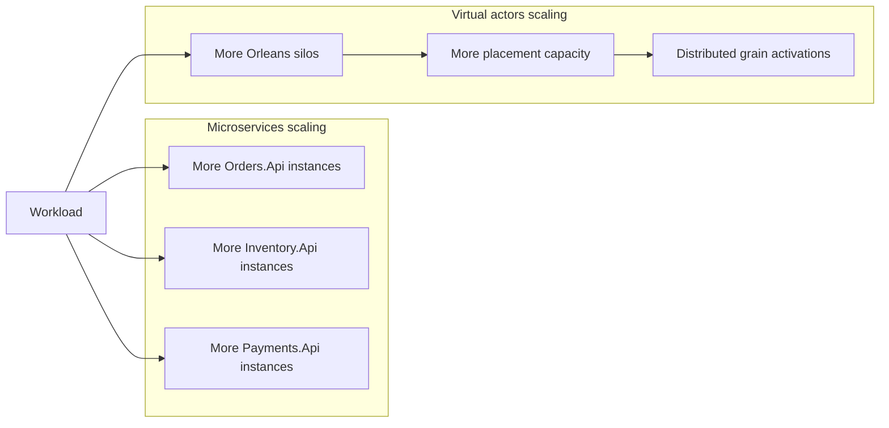

# Scaling comparison

The two approaches scale along different axes.

Microservices primarily scale by adding capacity to deployable service boundaries. Virtual actors primarily scale by adding Orleans cluster capacity and distributing actor activations across silos.

This document compares the scaling shape of both implementations. It is not a benchmark and it does not claim universal performance characteristics.

## Scaling axis

The main scaling difference is the boundary that receives additional capacity.

In the microservices implementation, capacity is usually added by scaling service instances:

- more `Orders.Api` instances
- more `Inventory.Api` instances
- more `Payments.Api` instances

In the virtual actor implementation, capacity is usually added by scaling Orleans silo capacity and distributing grain activations:

- more silo instances
- more available runtime capacity
- more placement options for grain activations

Both approaches can scale horizontally, but they expose different bottlenecks and operational choices.




## Microservices scaling

Microservices scale by service instance.

For example, the inventory service can be scaled independently when inventory reservation is the highest-load part of the workflow:

```powershell
docker compose -f deploy/microservices/docker-compose.yml up --build --scale inventory-api=3
```

This can be useful when one service has a different load profile from the others. For example, inventory reservation can be scaled separately from payment authorization.

## What scaling a microservice changes

Scaling a microservice adds more process capacity for that service boundary.

For example:

- scaling `Orders.Api` adds more workflow entry-point capacity
- scaling `Inventory.Api` adds more inventory API capacity
- scaling `Payments.Api` adds more payment authorization API capacity

However, scaling service instances does not automatically solve state consistency.

If multiple `Inventory.Api` instances serve reservation requests, inventory correctness still depends on the inventory service's persistence and update strategy. The inventory invariant must remain true regardless of how many service instances are running.

The important invariant is:

> Completed reservations must not reduce available inventory below zero.

## Microservices bottlenecks

The microservices implementation can encounter bottlenecks at several places:

- the `Orders.Api` workflow coordinator
- the `Inventory.Api` reservation endpoint
- the inventory database or update strategy
- the `Payments.Api` authorization endpoint
- network calls between services
- gateway-to-backend request fan-out

Scaling one service helps only when that service boundary is the bottleneck. If the real bottleneck is a shared database row, a lock, a hot product, or a downstream dependency, adding more service instances may not improve throughput and can increase contention.

## Microservices operational trade-offs

Scaling microservices gives clear operational control over service boundaries, but it also increases operational surface area.

More instances create more:

- logs
- metrics
- health checks
- network paths
- configuration combinations
- deployment units to observe

This makes correlation IDs and structured logging important. A single scenario run can cross the gateway, order service, inventory service, and payment service.

## Virtual actors scaling

Virtual actors scale by adding Orleans silo capacity and distributing grain activations.

In this sample, `Ordering.Api` may host Orleans in-process for local simplicity. A production-style deployment would typically separate API hosting from silo hosting, run multiple silo instances, or otherwise design the Orleans hosting topology explicitly.

The important comparison point is that scaling happens around actor runtime capacity and stateful identity placement rather than around separate business-service HTTP boundaries.

## What scaling virtual actors changes

Adding silo capacity increases the available runtime capacity for grain activations.

For example:

- more order identities can be active across the cluster
- more product inventory identities can be placed across available silos
- more customer or account identities can be activated across available silos

The actor runtime manages activation and placement, but the application still needs a good identity model. Grain identity choice determines where state and contention concentrate.

## Virtual actor bottlenecks

The virtual actor implementation can encounter bottlenecks around hot identities.

For example, if many requests target the same product, those requests concentrate around one `InventoryItemGrain(productId)`. Actor-level serialization helps protect the product inventory invariant, but it also means that one hot product identity can become a bottleneck.

Adding more silos helps distribute many identities. It does not automatically split one hot identity into multiple independent execution points.

This is an important distinction:

- many products with distributed demand can spread across many grain activations
- one extremely hot product can still concentrate work around one grain identity

## Virtual actor operational trade-offs

Scaling virtual actors shifts operational attention toward the actor runtime.

Operators and developers need to understand:

- silo capacity
- grain placement
- activation behavior
- persistence strategy
- state compatibility
- hot grain detection
- runtime metrics and logs

The runtime reduces some explicit service-to-service coordination code, but the system still needs observability and operational discipline.

## Comparing the scaling models

The two implementations answer different scaling questions.

For microservices, the primary question is:

> Which service boundary needs more capacity?

For virtual actors, the primary question is:

> Which stateful identities are active, where are they placed, and are any identities hot?

Both questions matter in real systems. The better fit depends on whether the domain workload naturally follows service boundaries, identity boundaries, or a mixture of both.

## Hot product contention

The hot product contention scenario is useful because it shows that neither architecture removes contention.

In the microservices implementation, hot product contention concentrates around `Inventory.Api` and its persistence/update strategy.

In the virtual actor implementation, hot product contention concentrates around `InventoryItemGrain(productId)`.

Both designs must preserve the same correctness rule:

> Inventory must not be over-reserved.

The difference is where the contention is managed.

## Idempotent duplicate requests

Duplicate request scenarios also scale differently.

In the microservices implementation, `Orders.Api` must coordinate concurrent duplicate submissions around an idempotency key and the persisted logical order result.

In the virtual actor implementation, duplicate submissions targeting the same logical order can be coordinated by `OrderGrain(orderId)` and its stored state.

In both cases, scaling must preserve the rule that duplicate submissions do not create multiple unique successful orders or reserve inventory more than once.

## Blazor Server UI scaling note

The comparison UI uses Blazor Server because the dashboard is a developer-facing tool.

Server-side UI state and SignalR circuits are part of the UI deployment model. They should not be confused with the backend architecture comparison.

Scaling the UI is a separate concern from scaling either backend implementation. The UI exists to run scenarios, display results, and make trade-offs visible during local or demo use.

## Practical takeaway

Microservices scale by adding capacity to explicit service boundaries. This is useful when services have different load profiles, but state consistency and cross-service workflow behavior remain explicit design responsibilities.

Virtual actors scale by adding runtime capacity and distributing actor identities. This is useful when the workload naturally partitions by identity, but hot identities, placement, persistence, and runtime behavior become central design concerns.

Neither model removes the need to understand the workload. Scaling only helps when added capacity is applied to the actual bottleneck.
