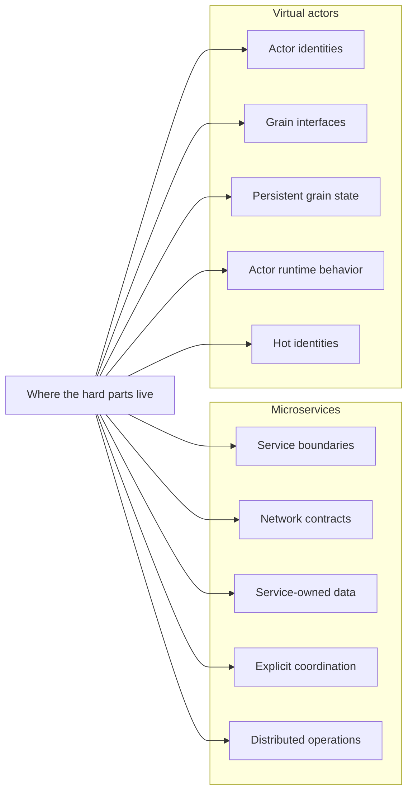

# Trade-offs

Microservices and virtual actors can implement the same workflow correctly, but they place ownership, coordination, consistency, and operational complexity at different boundaries.

The comparison is not intended to prove that one architecture is universally better. It is intended to help readers identify which responsibilities dominate a real workload and where each architecture makes those responsibilities explicit.

## Summary

Microservices are often a strong fit when boundaries are organizational, independently deployable, and capability-oriented.

Virtual actors are often a strong fit when state naturally partitions by durable identity and the difficult part is coordinating many stateful entities safely.

Both approaches still require clear contracts, deterministic failure policy, idempotency, persistence, observability, testing, and operational discipline.

## State ownership

State ownership is the main difference behind most of the trade-offs.

In a microservices architecture, state is typically owned by a service or bounded context and protected through that boundary's persistence model and contracts. In this repository, `Orders.Api` owns order records and order idempotency, `Inventory.Api` owns inventory and reservations, and `Payments.Api` owns payment attempts and authorization outcomes.

In a virtual actor architecture, state is owned by actor identities. In this repository, `OrderGrain(orderId)` owns one logical order workflow, `InventoryItemGrain(productId)` owns inventory for one product identity, and `PaymentAccountGrain(customerId)` owns payment behavior for one customer or account identity.

Both designs must answer the same questions:

- Who owns the state?
- Who may change it?
- Who protects the invariant?
- Who records the terminal result?
- Who recognizes and resolves duplicate requests?

The architecture changes where those answers appear and how they are enforced.

## Concurrency and invariants

Microservices do not become concurrency-safe merely because state is placed behind a service. The state owner still needs an explicit strategy such as transactions, optimistic concurrency, compare-and-swap operations, locks, serialized command handling, or partitioned ownership.

Virtual actors align coordination with an actor identity. Orleans processes requests for a non-reentrant grain activation sequentially by default, but reentrancy and interleaving can change scheduling behavior. Grain design and runtime configuration therefore remain part of the correctness model.

The central rule in the sample is the same for both implementations:

> Inventory must not be over-reserved.

The trade-off is how the serialization boundary is expressed:

- microservices use explicit concurrency protection at service-owned state
- virtual actors align coordination with one grain identity and its state

## Workflow coordination

Microservices commonly coordinate workflows through synchronous calls, asynchronous messages, workflow engines, sagas, or a combination of those mechanisms. Each remote boundary introduces contracts, latency, partial failure, retries, and compatibility concerns.

Virtual actors coordinate through calls between stateful identities. Strongly typed grain calls reduce transport ceremony in application code, but they remain distributed interactions that can involve serialization, placement, persistence, and runtime failure.

Coordination exists in both designs. The distinction is whether it is expressed primarily across service and network boundaries or through actor identities and an actor runtime.

## Failure handling and compensation

Neither architecture chooses business failure policy automatically. Both need explicit behavior for situations such as:

- insufficient inventory
- payment failure after reservation
- payment timeout after reservation
- concurrent duplicate submissions
- compensation that releases inventory
- ambiguous downstream outcomes
- process or node failure during a workflow

In microservices, failure handling is commonly visible in service responses, message processing, persistence updates, retry policies, and compensation across independently owned boundaries.

In virtual actor systems, failure handling is commonly visible in actor-call outcomes, persisted workflow state, reminders or timers, retries, and compensation between identities.

The repository uses deterministic policies so both implementations can be compared through the same scenario expectations. Those policies are intentionally simpler than a production recovery and reconciliation model.

## Idempotency

Idempotency is required in both architectures whenever callers may retry or submit duplicate work.

A microservices implementation commonly protects the relationship between an idempotency key and one logical result at a service and persistence boundary. Concurrent duplicates require atomic protection rather than only an initial lookup.

A virtual actor implementation can align idempotency with stable actor identity and persisted actor state. That can simplify ownership, but it does not remove decisions about key scope, request mismatch, retention, retries, or result replay.

Neither architecture defines idempotency semantics automatically. Both need clear rules for:

- what counts as the same request
- how concurrent duplicates are coordinated
- how long results are retained
- what happens when the same key is reused with different input
- which terminal result is returned

## Scaling and contention

Microservices add capacity at explicit service boundaries. This is useful when capabilities have different demand profiles, but adding instances does not automatically increase throughput when the bottleneck is a database row, lock, queue partition, downstream system, or hot business key.

Virtual actors add runtime capacity and distribute actor activations across nodes. This is useful when demand spreads across many independent identities. It does not automatically divide one hot identity into several independent state owners.

The primary questions differ:

- microservices ask which service, queue, or persistence boundary needs more capacity
- virtual actors ask which identities are active, how they are placed, and which identities are hot

### Hot identities

A hot product demonstrates that state ownership and serialization can become throughput boundaries.

In a microservices design, requests may concentrate around the inventory service and the persistence update for one product.

In a virtual actor design, requests may concentrate around one inventory actor and the work serialized for that identity.

Adding service instances or actor-runtime nodes does not automatically partition one hot key. Supporting more parallel work may require a deliberate change to the domain partitioning, consistency model, or aggregation strategy.

## Compatibility and evolution

Microservices expose compatibility concerns through network contracts, independently deployed versions, persistence schemas, event formats, and rollout order.

Virtual actors expose compatibility concerns through actor interfaces, serialized calls, persisted actor state, cluster versions, and runtime behavior.

Both require deliberate versioning and state evolution. Independent deployment does not make compatibility automatic, and runtime-managed activation does not make persisted-state changes automatic.

The practical difference is which contracts and state boundaries must remain compatible while the system evolves.

## Deployment and operations

Microservices make business-service processes and network paths explicit. This can align deployment and ownership with team boundaries, but it also creates more endpoints, compatibility combinations, health observations, logs, traces, and independent failure modes.

Virtual actors reduce some explicit service-to-service coordination in application code, but the actor runtime becomes part of the operational model. Teams need to understand cluster membership, placement, activation, persistence, hot identities, request scheduling, and state compatibility.

Neither architecture removes operational complexity. Each places it at different boundaries and requires different diagnostic knowledge.

The repository uses the .NET Aspire AppHost as a development instrument. The Aspire dashboard provides detailed resource state, endpoints, logs, traces, and metrics. `Workbench.Ui` provides curated scenario comparison, evaluated health, static topology explanation, and concise trade-off guidance. These repository tools illustrate operational concerns but are not a production deployment blueprint.

## Performance interpretation

Elapsed time in the Workbench UI is local feedback, not benchmark evidence.

Microservice workflows may cross more explicit network boundaries. Virtual actor workflows may route more coordination through an actor runtime. Those topology differences can affect latency and throughput, but they do not establish a general performance result.

Production performance depends on workload distribution, network topology, resource limits, persistence, serialization, placement, hot identities, runtime configuration, and operational tuning.

A credible comparison requires controlled infrastructure, repeatable workloads, warmup, several capacity levels, latency distributions, throughput, error rates, and resource measurements. This repository does not attempt that study.

## Testing trade-offs

Microservices tests often emphasize:

- service contracts and endpoint behavior
- downstream-client behavior
- service-owned persistence
- concurrency and idempotency protection
- compensation across service boundaries

Virtual actor tests often emphasize:

- actor behavior and identity
- persisted actor state
- scheduling and serialized execution
- coordination through actor calls
- idempotency at the actor identity boundary

Both architectures also need acceptance and regression tests that protect externally visible behavior. Implementation-focused tests alone are not enough.

## Choosing a fit

Favor microservices when the strongest drivers are:

- independently deployable business capabilities
- organizational ownership aligned with service boundaries
- explicit integration contracts
- separate scaling and release cadence by capability
- teams equipped to operate distributed services

Favor virtual actors when the strongest drivers are:

- durable stateful identities
- identity-local invariants
- large numbers of independently active entities
- workflow ownership that naturally follows one identity
- teams prepared to operate an actor runtime and evolve persistent actor state

Many real systems combine both styles. A service boundary can contain actor-based state ownership, while explicit services remain useful for organizational, integration, or security boundaries.

## Practical takeaway

The useful question is not which architecture has fewer files, fewer network calls, or better local elapsed time.

The useful question is where the hard responsibilities belong for the workload and organization:

- Microservices place them around service contracts, service-owned persistence, remote coordination, explicit concurrency control, and operational service boundaries
- Virtual actors place them around actor identity, actor state, request scheduling, runtime behavior, placement, and hot identities

The same workflow can be implemented correctly in both styles. The best fit depends on workload identity, consistency requirements, deployment boundaries, team ownership, operational capability, and expected evolution.

## Related documentation

- [Problem](01-problem.md)
- [Microservices design](02-microservices-design.md)
- [Virtual actors design](03-virtual-actors-design.md)
- [Development comparison](04-development-comparison.md)
- [Deployment comparison](05-deployment-comparison.md)
- [Scaling comparison](06-scaling-comparison.md)
- [Organizational scaling and architecture fit](08-organizational-scaling-and-architecture-fit.md)
- [Scenario guide](12-scenario-guide.md)
- [Observability and operations](16-observability-and-operations.md)
- [Known limitations](17-known-limitations.md)
