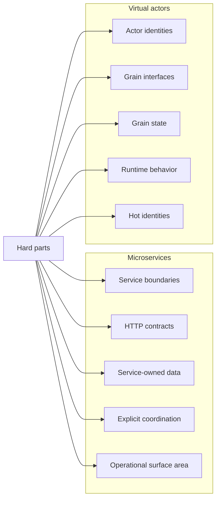

# Trade-offs

Both implementations solve the same order workflow, but they expose different trade-offs.

The comparison is not about proving that one architecture is universally better. The useful part is seeing where each architecture places state ownership, concurrency control, workflow coordination, failure handling, scaling pressure, and operational complexity.

## Summary

Microservices are useful when boundaries are organizational, deployable, and capability-oriented.

Virtual actors are useful when state is naturally partitioned by identity and the difficult part is coordinating many stateful identities.

Both approaches still require clear contracts, deterministic failure handling, idempotency, observability, testing, and operational discipline.

## State ownership

State ownership is the main difference behind most of the trade-offs.

In the microservices implementation, state is owned by services:

- `Orders.Api` owns order workflow records and idempotency behavior.
- `Inventory.Api` owns inventory state and inventory invariants.
- `Payments.Api` owns payment authorization behavior.

In the virtual actor implementation, state is owned by actor identities:

- `OrderGrain(orderId)` owns one logical order workflow.
- `InventoryItemGrain(productId)` owns inventory state for one product identity.
- `PaymentAccountGrain(customerId)` owns payment behavior for one customer or account identity.

The same business questions must be answered in both designs:

- Who owns the state?
- Who is allowed to change the state?
- Who protects the invariant?
- Who records the final result?
- Who handles duplicate requests?

The architecture style changes where those answers appear.

## Concurrency

Both implementations should prevent over-reservation in the concurrent orders scenario.

This does not mean microservices are automatically concurrency-safe. It means the microservice implementation has explicit concurrency control at the state owner, `Inventory.Api`.

The virtual actor implementation prevents over-reservation through `InventoryItemGrain(productId)`, which serializes operations for a product identity.

The comparison is therefore:

- microservices: explicit protection at the service-owned state boundary
- virtual actors: natural per-identity serialization through the actor model

The important correctness rule is the same in both implementations:

> Inventory must not be over-reserved.

## Workflow coordination

The microservices implementation coordinates the workflow through HTTP calls between services.

A successful order requires `Orders.Api` to reserve inventory through `Inventory.Api`, authorize payment through `Payments.Api`, and then record the final order outcome.

The virtual actor implementation coordinates the workflow through grain calls.

A successful order requires `OrderGrain(orderId)` to call `InventoryItemGrain(productId)`, call `PaymentAccountGrain(customerId)`, and then record the final order outcome in the order grain state.

The trade-off is not whether coordination exists. Coordination exists in both designs. The trade-off is whether coordination is expressed across service/network boundaries or across actor identity boundaries.

## Failure handling and compensation

Both implementations must define explicit failure behavior.

Examples include:

- inventory is insufficient
- payment fails after inventory has been reserved
- payment times out after inventory has been reserved
- duplicate submissions arrive concurrently
- compensation is required to release inventory

In the microservices implementation, failure handling is visible through service responses, client calls, persistence updates, and compensation requests between services.

In the virtual actor implementation, failure handling is visible through grain method results, grain state transitions, and compensation calls between grains.

The actor model can make workflow state easier to colocate with the workflow identity, but it does not decide business policy automatically. The implementation still needs deterministic rules for rejection, timeout handling, compensation, and final result reporting.

## Idempotency

Idempotency is required in both implementations.

In the microservices implementation, `Orders.Api` explicitly owns the relationship between an idempotency key and a logical order result. Duplicate submissions should return the existing result instead of creating another order or reserving inventory again.

In the virtual actor implementation, `OrderGrain(orderId)` can use stable actor identity and stored grain state to return the existing logical result for duplicate submissions targeting the same order identity.

The trade-off is where duplicate-request coordination is implemented:

- microservices: explicit idempotency handling at the order service and persistence boundary
- virtual actors: idempotency aligned with order grain identity and state

Both designs still need clear semantics for what counts as a duplicate and how duplicate responses are reported.

## Scaling

Microservices scale by adding capacity to service boundaries.

For example, if inventory reservation is the bottleneck, more `Inventory.Api` instances can be added. This is useful when services have different load profiles.

Virtual actors scale by adding Orleans runtime capacity and distributing grain activations across silos.

This is useful when the workload naturally partitions by identity, such as many independent order, product, or customer identities.

The trade-off is the scaling question each architecture asks:

- microservices: which service boundary needs more capacity?
- virtual actors: which identities are active, where are those identities placed, and are any identities hot?

Neither approach removes bottlenecks. Scaling only helps when added capacity targets the actual bottleneck.

## Hot identities

A hot product is a useful reminder that virtual actors do not remove contention. They make the contention explicit by state identity.

In the microservices implementation, the hot product is protected by `Inventory.Api` and its state store.

In the virtual actor implementation, the hot product is protected by `InventoryItemGrain(productId)` for that product identity.

The trade-off is where contention is managed:

- microservices: around the inventory service and its persistence/update strategy
- virtual actors: around the inventory grain for the product identity

A hot product can still be a bottleneck in both designs.

## Performance timing

Elapsed time in the UI is local demo feedback, not a benchmark.

The microservice workflow crosses more HTTP boundaries:

- gateway to `Orders.Api`
- `Orders.Api` to `Inventory.Api`
- `Orders.Api` to `Payments.Api`

The virtual actor workflow keeps more coordination inside the Orleans runtime path.

Local elapsed time can help explain the sample topology, but it should not be treated as a general performance conclusion. Production performance depends on network topology, persistence, placement, hot keys, deployment shape, runtime configuration, database behavior, and operational tuning.

## Operational complexity

The microservices implementation has more explicit deployable service boundaries.

This can make ownership and deployment responsibilities clearer, but it also creates more processes, network paths, logs, health checks, configuration values, and failure modes to operate.

The virtual actor implementation reduces some explicit service-to-service calls in application code, but it makes Orleans runtime behavior part of the operational model.

Operators and developers need to understand grain placement, activation, persistence, hot identities, silo behavior, and actor state compatibility.

Neither approach removes operational complexity. Each approach moves the complexity to a different boundary.

## Testing trade-offs

Microservices tests tend to focus on:

- service contracts
- HTTP-facing behavior
- downstream client behavior
- persistence behavior
- compensation paths
- idempotency at the service boundary

Virtual actor tests tend to focus on:

- grain behavior
- actor identity
- grain state
- serialized execution
- workflow coordination through grain calls
- idempotency at the actor identity boundary

Both implementations need scenario regression tests that protect externally visible behavior, not only implementation details.

## Practical takeaway

Use the microservices style when deployable business capabilities, organizational ownership, independent service scaling, and explicit service contracts are the main design drivers.

Use the virtual actor style when the domain is naturally partitioned by stateful identities and the main challenge is coordinating many independent stateful entities safely.

The same workflow can be implemented correctly in both styles. The important difference is where each style places the hard parts.
