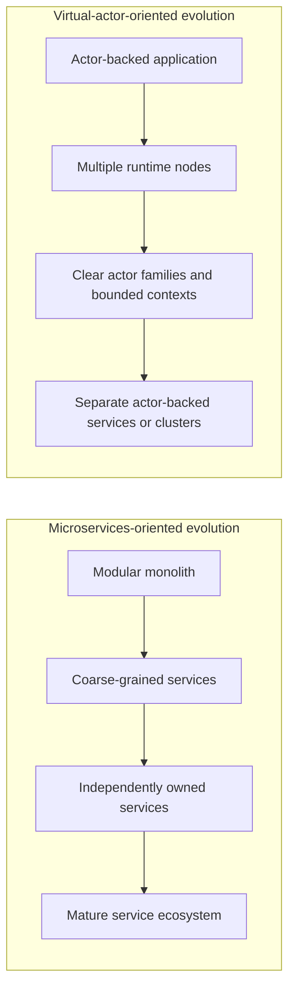
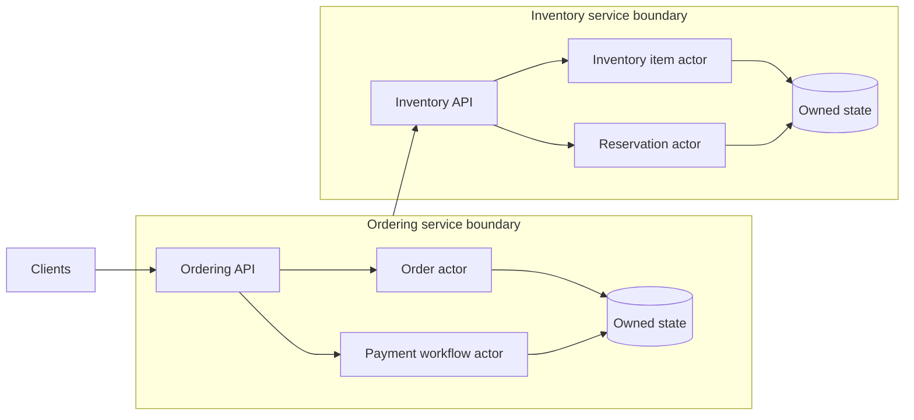

# Organizational scaling and architecture fit

Architecture choices shape more than code. They influence team ownership, delivery independence, operational responsibility, product quality, and how safely a system can evolve.

Microservices and virtual actors address different pressures:

- Microservices primarily organize independently owned business capabilities behind explicit service boundaries
- Virtual actors primarily organize state and behavior around durable identities managed by an actor runtime

Neither approach is universally better. Both can improve clarity when their boundaries match the domain and organization. Both can reduce product quality when adopted without the ownership, platform, and operational discipline they require.

## Core thesis

Microservices are often as much an organizational scaling strategy as a technical architecture. A useful service boundary commonly aligns with a business capability, a bounded context, and a team able to own the service throughout its lifecycle.

That lifecycle includes:

- domain behavior
- data ownership
- contracts
- testing
- deployment
- observability
- incident response
- maintenance
- compatibility
- deprecation and retirement

This ownership model can help larger organizations move independently. It can be costly when one small team must operate many services, databases, contracts, pipelines, dashboards, and failure modes before those boundaries provide real autonomy.

Virtual actors address a different problem. They place behavior and state around durable identities. This can keep important coordination inside an application and actor runtime while still making identity ownership explicit.

Virtual actors are not simple by default. Complexity appears through identity design, actor state, activation, placement, persistence, scheduling, hot identities, and cluster behavior.

The key difference is where complexity appears first:

- Microservices externalize complexity through service, network, data, deployment, and team boundaries
- Virtual actors internalize more decomposition through identity, state, runtime, placement, and persistence boundaries

Both approaches should be adopted deliberately rather than as default architecture labels.

## Start from the boundary that matters

A useful design starts from the boundary that owns the difficult responsibility.

For microservices, ask:

> Is this a business capability or bounded context that a team can own end to end?

For virtual actors, ask:

> Which identity owns this state, behavior, and invariant?

These questions are more useful than asking whether another API or another grain can be created.

## Approaching microservices

A microservice boundary is valuable when it creates meaningful ownership and delivery independence.

Strong candidates usually have:

- a clear business capability
- consistent domain language
- clear data ownership
- identifiable consumers
- clear operational responsibility
- a reason to deploy, secure, or scale independently
- a team that can own the full lifecycle

Weak candidates often have:

- unclear ownership
- shared data controlled by several services
- frequent lockstep changes
- boundaries that mirror technical layers instead of domain capabilities
- little reason to deploy or scale independently
- teams unable to operate the additional service autonomously

A useful adoption rule is:

> Make domain boundaries explicit early, but distribute deployment only when the boundary earns its operational cost.

A modular monolith or a small number of coarse-grained services can be a better starting point than many premature microservices. The goal is useful autonomy, not a high service count.

## Approaching virtual actors

An actor boundary is valuable when one stable identity naturally owns state, behavior, or an invariant.

Strong candidates usually have:

- stable identity
- identity-specific state
- identity-local invariants
- per-identity concurrency requirements
- many independent instances
- behavior that belongs with the state
- a clear persistence and lifecycle model

Weak candidates often have:

- unclear identity
- mostly stateless transformation work
- global coordination across many entities
- a small number of extremely hot identities
- rapidly changing state without migration discipline
- one actor accumulating too many responsibilities

A useful adoption rule is:

> Keep decomposition inside the actor runtime while it helps, but introduce stronger ownership and deployment boundaries when scale, isolation, release cadence, or team structure requires them.

The goal is not to put everything into actors. The goal is to model stateful identity where it improves correctness and clarity.

## Start simple and split deliberately

Both approaches can start simple and evolve, but they split at different boundaries.

Evolution is not required to follow every step. The diagram shows possible directions, not a maturity ladder.

A common fear is that postponing distribution will make a later split impossible. That fear can cause teams to create network, persistence, and release boundaries before the domain is understood.

Premature distribution often makes future change harder because an incorrect boundary becomes an API, database, deployment pipeline, compatibility contract, and ownership commitment.

A better rule is:

> Split when the boundary is understood and its current value exceeds its delivery and operational cost.

## Application fit

### When microservices fit well

Microservices are often a strong fit when independent business ownership and delivery dominate the problem.

Examples include systems with:

- several product or domain teams
- independently evolving business capabilities
- different release cadences
- different security, availability, or scaling requirements
- mature service ownership and platform support
- explicit contracts between teams or domains
- clear lifecycle ownership for each capability

Common domains include billing, logistics, customer identity, payments, marketplaces, and large enterprise platforms.

Microservices are less compelling when one team owns the entire product, most changes require coordinated edits across all services, or the organization lacks the platform and operational capacity to support independent services.

### When virtual actors fit well

Virtual actors are often a strong fit when stateful identity coordination dominates the problem.

Examples include systems with:

- many independent stateful entities
- workflows centered on stable identities
- per-identity concurrency rules
- resource reservation by key
- session, presence, or entity state
- behavior that naturally belongs with identity-owned state
- load that distributes across many identities

Common domains include IoT device management, game backends, collaboration, sessions and presence, auctions, reservations, and entity-centered workflow coordination.

Virtual actors are less compelling when most work is stateless, identity boundaries are unclear, global coordination dominates, or a small number of identities carry most of the workload.

## Hybrid architecture

Hybrid architecture is often realistic. Coarse business capabilities can remain explicit service boundaries while selected services use virtual actors for identity-oriented state and coordination.

A hybrid design can combine organizational service ownership with actor-based state management. It can also combine the complexity of both styles.

A hybrid architecture needs explicit rules for:

- service boundaries
- actor identity boundaries
- state ownership
- persistence ownership
- communication between bounded contexts
- observability and incident ownership
- compatibility and release behavior
- conditions that justify a separate service or cluster

## How microservices can degrade product quality

Microservices improve delivery when they create real autonomy. They degrade product quality when they create distributed complexity without autonomy.

Common failure patterns include:

- services split before boundaries are understood
- most features changing many services
- services always deployed together
- teams not owning services end to end
- shared database ownership
- deep synchronous call chains
- weak observability
- accidental contract coupling
- unclear incident responsibility
- platform work overwhelming product work

The product impact can include:

- slower delivery
- more integration defects
- fragile releases
- harder debugging
- more coordination meetings
- lower developer confidence
- more time spent on infrastructure than user value

This is the distributed-monolith failure mode: the system pays the cost of distribution without gaining meaningful autonomy.

## How virtual actors can degrade product quality

Virtual actors improve clarity when identity and state boundaries are well chosen. They degrade product quality when the actor model is used to avoid domain and ownership boundaries.

Common failure patterns include:

- poorly chosen actor identities
- one actor becoming a large orchestrator
- hot actors ignored until production load
- state evolving without migration discipline
- runtime behavior treated as magic
- unclear bounded contexts
- one shared actor runtime becoming an ownership-free bucket
- unclear responsibility for actor families
- weak observability
- persistence and activation behavior poorly understood

The product impact can include:

- hidden coupling
- state migration pain
- runtime surprises
- hot-identity bottlenecks
- unclear ownership as teams grow
- difficult actor-boundary refactoring
- ambiguous incident responsibility

This is the tangled actor-monolith failure mode: the system has many actors but weak domain, ownership, and lifecycle boundaries.

## Lifecycle ownership

Both approaches require lifecycle ownership, but ownership appears at different levels.

For microservices, a team may own:

- capability behavior
- service data
- contracts
- operational health
- consumer communication
- support and incident response
- compatibility
- deprecation and retirement

For virtual actors, a team may own:

- actor identity models
- interfaces and messages
- actor behavior
- persistent state
- storage and migration
- hot-identity behavior
- runtime assumptions
- operational visibility
- activation and placement implications

If no team owns the lifecycle, quality degrades regardless of architecture style.

## Organizational maturity

Architecture should match the organization's ability to operate it.

Microservices usually require mature support for:

- automated delivery
- service discovery and configuration
- contract and integration testing
- observability
- incident response
- data ownership
- dependency and release management

Virtual actors usually require mature support for:

- actor runtime operation
- cluster membership and lifecycle
- identity-aware diagnostics
- persistence and state migration
- placement and hot-identity analysis
- interface compatibility
- runtime-specific testing and recovery

A platform can reduce repeated operational work, but it does not replace ownership. Standard tooling is valuable only when teams understand the guarantees and failure modes behind it.

## Decision guidance

Favor microservices when the main problem is organizational and delivery scale:

- several teams need autonomy
- business capability ownership is clear
- independent deployment boundaries have real value
- service lifecycle ownership is mature
- platform and operations support exists
- contracts can be managed deliberately

Favor virtual actors when the main problem is stateful identity coordination:

- many entities have independent state
- per-identity serialization supports correctness
- workflows are naturally identity-centered
- actor runtime ownership is acceptable
- not every capability needs an independent deployment boundary
- identity and state evolution can be managed deliberately

Favor a hybrid when both are true:

- the organization needs coarse-grained service ownership boundaries
- selected capabilities have difficult stateful identity and concurrency problems
- teams can operate both service boundaries and actor runtime boundaries

Avoid both approaches as silver bullets. A poorly bounded microservice architecture becomes a distributed monolith. A poorly bounded virtual actor architecture becomes a tangled actor monolith.

## How this repository illustrates the ideas

The repository uses a deliberately small order workflow to make the boundaries visible.

The microservices implementation separates order coordination, inventory ownership, and payment behavior into `Orders.Api`, `Inventory.Api`, and `Payments.Api`. This illustrates explicit service ownership. It does not imply that every small team should begin with three deployable services for a similar domain.

The virtual actor implementation uses `OrderGrain(orderId)`, `InventoryItemGrain(productId)`, and `PaymentAccountGrain(customerId)` to illustrate identity-based ownership and coordination. It does not imply that every actor-backed capability should remain in one cluster or deployment forever.

The .NET Aspire AppHost and Workbench provide a development and comparison environment. They are not presented as a production organizational or deployment blueprint.

A real system could evolve toward a hybrid model, use different infrastructure, adopt asynchronous messaging, split bounded contexts differently, or avoid distribution until the ownership boundaries justify it.

## Relationship to evolution and release strategy

Architecture quality depends on whether teams can evolve the chosen boundaries safely.

For microservices, unsafe evolution commonly appears around service contracts, data ownership, event schemas, release order, and cross-service coordination.

For virtual actors, unsafe evolution commonly appears around actor identity, interfaces, persistent state, runtime behavior, and bounded-context ownership.

Detailed versioning, state migration, rolling deployment, and rollback concerns are covered in [Release, versioning, and rollback](14-release-versioning-and-rollback.md). Broader change patterns are covered in [Maintenance and evolution](15-maintenance-and-evolution.md).

## Key takeaways

- Microservices are often an organizational scaling strategy as much as a technical architecture
- Microservices work best when teams can own capabilities through the full lifecycle
- Microservices can slow delivery when organizations cannot support their operational and ownership overhead
- Virtual actors shift complexity toward identity, state, runtime behavior, and hot-identity management
- Virtual actors can keep some decomposition inside the application and runtime longer, but they still need deliberate domain and ownership boundaries
- Large actor systems may eventually need separate bounded contexts, ownership, services, clusters, or persistence boundaries
- Hybrid architecture is often realistic: services for organizational boundaries and virtual actors for identity-oriented coordination
- Architecture fit depends on team structure, ownership, domain shape, operational maturity, and expected evolution

## Related documentation

- [Problem](01-problem.md)
- [Microservices design](02-microservices-design.md)
- [Virtual actors design](03-virtual-actors-design.md)
- [Development comparison](04-development-comparison.md)
- [Deployment comparison](05-deployment-comparison.md)
- [Scaling comparison](06-scaling-comparison.md)
- [Trade-offs](07-tradeoffs.md)
- [Release, versioning, and rollback](14-release-versioning-and-rollback.md)
- [Maintenance and evolution](15-maintenance-and-evolution.md)
- [Known limitations](17-known-limitations.md)

## References

- [Microservices architecture style](https://learn.microsoft.com/en-us/azure/architecture/guide/architecture-styles/microservices)
- [Use domain analysis to model microservices](https://learn.microsoft.com/en-us/azure/architecture/microservices/model/domain-analysis)
- [Identify microservice boundaries](https://learn.microsoft.com/en-us/azure/architecture/microservices/model/microservice-boundaries)
- [Orleans overview](https://learn.microsoft.com/en-us/dotnet/orleans/overview)
- [Deploy an Orleans application](https://learn.microsoft.com/en-us/dotnet/orleans/deployment/)
- [Bounded Context](https://martinfowler.com/bliki/BoundedContext.html)
