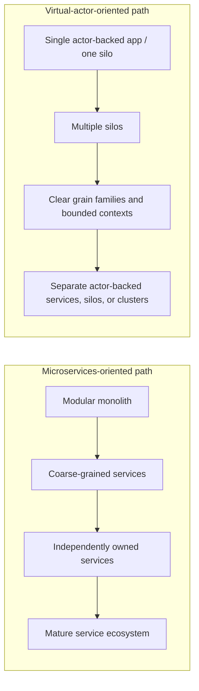
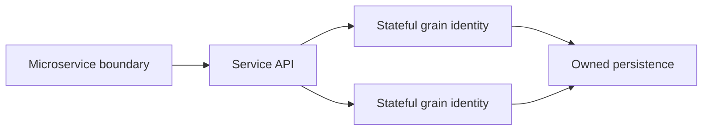

# Organizational scaling and architecture fit

This document compares microservices and virtual actors from a broader product, team, and organizational perspective.

The earlier documents focus mostly on technical design, deployment, scaling, validation, observability, and maintenance. This document focuses on a different question:

> Which architecture style fits the team, ownership model, delivery model, domain shape, and organizational maturity behind the system?

The short answer is that microservices and virtual actors solve different problems at different boundaries. Microservices are strongest when the organization needs independently owned business capabilities with clear lifecycle ownership. Virtual actors are strongest when the domain is naturally partitioned by stateful identity and the system needs safe coordination around many independent stateful entities.

Neither approach is universally better. Both can be overused. Both can become hard to operate. Both can degrade product quality when the organization adopts the structure without the discipline needed to support it.

## Core thesis

Microservices are often as much an organizational scaling strategy as a technical architecture.

A good microservice boundary should usually align with a business capability, a bounded context, and a team that can own the service through its full lifecycle. That lifecycle includes design, implementation, testing, deployment, observability, incident response, maintenance, improvement, and eventual deprecation or sunset.

That ownership model can work very well in larger organizations because it allows teams to move independently. It can also be painful in smaller organizations or immature platform environments because the same team may have to operate many services, many contracts, many data stores, many deployment pipelines, many dashboards, and many compatibility boundaries before those boundaries provide enough benefit.

Virtual actors solve a different problem. They organize behavior around stateful identity rather than around separately deployable business services. This can let a team keep more decomposition inside the application and actor runtime at the beginning, while still modeling many stateful identities explicitly.

That does not make virtual actors simple by default. Virtual actors can be complex from the start when the domain, runtime, persistence, or identity model is complex. The difference is where the complexity first appears:

- Microservices tend to externalize complexity early through infrastructure, deployment, network, data, and ownership boundaries.
- Virtual actors tend to internalize more of the early decomposition inside the application/runtime model through grain identity, grain state, activation, placement, and silo behavior.

Both approaches should therefore be adopted deliberately, not as default architecture labels.

## How to approach microservices

Approach microservices from ownership boundaries outward.

The first question should not be:

> Can this code be split into another API?

The better question is:

> Is this a business capability or bounded context that a team can own end to end?

A microservice boundary is valuable when it creates a meaningful ownership and delivery boundary. A team should be able to own the service's behavior, data, API contract, operational health, release process, documentation, and lifecycle.

Good microservice candidates usually have:

- a clear business capability
- clear domain language
- clear data ownership
- clear consumers
- clear operational responsibility
- a reason to deploy or scale independently
- a team that can own the service lifecycle

Poor microservice candidates usually have:

- unclear ownership
- unclear data boundaries
- frequent lockstep changes with other services
- shared database ownership
- API boundaries that simply mirror technical layers
- a team that cannot operate the additional service independently

The most important adoption rule is:

> Make boundaries explicit early, but delay distributed deployment until the boundary earns its cost.

That means a modular monolith or a small number of coarse-grained services can be a better starting point than many premature microservices.

## How to approach virtual actors

Approach virtual actors from stateful identity boundaries outward.

The first question should not be:

> Can this class become a grain?

The better question is:

> Which identity owns this state, behavior, and invariant?

Virtual actors are useful when the domain has stable identities that naturally own state and behavior. A grain boundary is valuable when it protects an invariant, coordinates state for one identity, or makes per-identity workflow easier to reason about.

Good virtual actor candidates usually have:

- stable identity
- identity-specific state
- identity-specific invariants
- per-identity concurrency requirements
- many independent instances
- behavior that naturally belongs with the state
- a clear persistence and lifecycle model

Poor virtual actor candidates usually have:

- unclear identity
- mostly stateless request processing
- global coordination across many entities
- a small number of extremely hot identities
- state that changes shape frequently without migration discipline
- orchestration that would make one grain too large

The most important adoption rule is:

> Keep decomposition inside the runtime while it helps, but introduce stronger boundaries when ownership, scaling, isolation, or release cadence requires them.

A team can start with one actor-backed application or one Orleans cluster when that is enough. Later, the system can evolve toward multiple silos, separate grain assemblies, separate storage boundaries, separate actor-backed services, or separate clusters when there is a real reason.

## Start simple, split deliberately

Both approaches can start simple and split later, but the split happens at different boundaries.

A microservices-oriented evolution path can look like this:

```text
modular monolith
  -> coarse-grained services
  -> independently owned services
  -> mature service ecosystem
```

A virtual-actor-oriented evolution path can look like this:

```text
single actor-backed application / one silo
  -> multiple silos for scale and fault tolerance
  -> clearer grain families and bounded contexts
  -> separated actor-backed services, silos, or clusters when justified
```




The key is to avoid splitting because of fear.

A common fear is:

> If we do not split now, it will be too much work later.

That fear can lead teams to create distributed systems before the domain boundaries are understood and before the organization can support the operational model. Premature splitting can make future change harder because wrong boundaries become network APIs, separate databases, deployment pipelines, and compatibility constraints.

The better rule is:

> Split when the boundary is understood and the benefit now exceeds the operational cost.

## Application fit

## Microservices fit well when organizational boundaries dominate

Microservices are a strong fit when the primary problem is independent ownership and delivery across business capabilities.

They tend to fit well for:

- large business platforms with multiple product teams
- systems with independently evolving business domains
- systems where capabilities have different release cadence
- systems where capabilities need different scaling profiles
- platforms where service ownership is mature
- systems requiring clear contracts between teams or domains
- systems where each bounded context has a clear lifecycle owner

Example domains can include:

- billing platforms
- customer identity platforms
- logistics platforms
- payment platforms
- marketplace platforms
- large enterprise platforms with multiple business capabilities

Microservices are less compelling when one team owns everything and most features require coordinated changes across all services.

## Virtual actors fit well when stateful identity dominates

Virtual actors are a strong fit when the primary problem is stateful identity coordination.

They tend to fit well for:

- systems with many independent stateful entities
- workflows centered around stable identities
- per-identity concurrency control
- resource reservation by key
- session-like or entity-like state management
- domains where behavior naturally belongs with state
- systems where scaling many identities is more important than splitting many services early

Example domains can include:

- IoT device state management
- game backends
- real-time collaboration
- user/session/presence systems
- order workflow engines
- reservation systems
- auctions or bidding by item
- entity-centered workflow orchestration

Virtual actors are less compelling when most work is stateless, identity boundaries are unclear, or global coordination dominates the workload.

## Hybrid architecture fit

A hybrid architecture is often realistic.

Use microservices for coarse business capability boundaries and virtual actors inside selected services where stateful identity coordination is difficult.

Examples:

```text
Ordering service
  -> OrderGrain(orderId)
  -> PaymentWorkflowGrain(orderId)
```

```text
Inventory service
  -> InventoryItemGrain(productId)
  -> ReservationGrain(reservationId)
```

```text
IoT platform
  -> DeviceManagement service
      -> DeviceGrain(deviceId)
  -> Billing service
  -> Notification service
```

This can combine organizational ownership boundaries with actor-based state management.




The risk is that hybrid systems can combine the complexity of both styles. A hybrid architecture needs clear rules about:

- where service boundaries are
- where actor identity boundaries are
- who owns state
- how persistence is organized
- how observability works
- how operational responsibility is assigned
- when actor-backed capabilities should become separate services or clusters

## How microservices can degrade product quality

Microservices can improve delivery when they create true autonomy. They can degrade product quality when they create distributed complexity without autonomy.

Common degradation patterns include:

- services are split before boundaries are understood
- every feature touches many services
- services are always deployed together
- teams do not own services end to end
- local development becomes slow and fragile
- observability is weak
- contracts become accidental coupling
- data ownership is unclear
- synchronous call chains become deep and brittle
- shared databases undermine service boundaries
- incident ownership is unclear

Product impact:

- slower feature delivery
- more integration bugs
- harder debugging
- more coordination meetings
- fragile releases
- lower developer confidence
- more time spent on plumbing than product behavior

This is the distributed monolith failure mode: the system has the cost of microservices but not the autonomy benefit.

## How virtual actors can degrade product quality

Virtual actors can improve clarity when identity boundaries are well chosen. They can degrade product quality when the actor model is used to avoid architectural boundaries.

Common degradation patterns include:

- grain identities are poorly chosen
- one grain becomes a giant orchestrator
- hot grains are ignored
- grain state evolves without discipline
- actor runtime behavior is treated as magic
- bounded contexts are not defined
- everything stays in one actor-backed runtime too long
- ownership of grain families is unclear
- observability is weak
- persistence and activation behavior are poorly understood

Product impact:

- hidden coupling
- state migration pain
- runtime surprises
- bottlenecks around hot identities
- difficult ownership as teams grow
- harder refactoring of actor boundaries
- unclear responsibility for incidents

This is the tangled actor-monolith failure mode: the system has many grains but not clear domain, ownership, or lifecycle boundaries.

## Lifecycle ownership matters in both approaches

Both approaches require lifecycle ownership, but the ownership appears at different levels.

For microservices, lifecycle ownership means a team owns a service as a product-like unit:

- behavior
- data
- API contract
- operational health
- documentation
- consumer communication
- support
- improvement
- deprecation or sunset

For virtual actors, lifecycle ownership means a team owns an actor-backed domain area:

- grain identity model
- grain interfaces
- grain behavior
- grain state
- persistence model
- hot identity behavior
- operational visibility
- state evolution
- runtime assumptions

If no team owns the lifecycle, quality will degrade regardless of architecture style.

## Evolution paths

### Microservices evolution path

A healthy microservices evolution path is deliberate:

1. Start with clear domain modules or coarse services.
2. Identify bounded contexts with distinct ownership and language.
3. Extract services when independent ownership, scaling, reliability, or delivery needs justify the cost.
4. Invest in platform support, observability, contract testing, and lifecycle ownership.
5. Avoid multiplying services faster than the organization can own them.

The goal is not to maximize service count. The goal is to maximize useful autonomy.

### Virtual actors evolution path

A healthy virtual actor evolution path is also deliberate:

1. Start with clear stateful identities and invariants.
2. Keep early deployment simple when possible.
3. Add silos for scale and fault tolerance when needed.
4. Separate grain families and persistence boundaries as bounded contexts become clearer.
5. Split into separate services, silos, or clusters when ownership, scaling, isolation, or operational needs justify it.
6. Avoid letting one actor-backed runtime become an ownership-free shared bucket.

The goal is not to put everything into grains. The goal is to model stateful identity where it improves correctness and clarity.

## Decision guidance

Choose microservices when the main problem is organizational and delivery scale:

- many teams need autonomy
- business capability ownership is clear
- independent deployment boundaries matter
- service lifecycle ownership is mature
- platform and operations support exists
- service contracts can be managed deliberately

Choose virtual actors when the main problem is stateful identity coordination:

- many entities have independent state
- per-identity serialization helps correctness
- workflows are naturally identity-centered
- actor runtime ownership is acceptable
- deployment does not need to be split by every capability yet
- grain state and identity evolution can be managed deliberately

Choose a hybrid when both are true:

- the organization needs coarse-grained service ownership boundaries
- selected capabilities have hard stateful identity and concurrency problems
- teams can operate both service boundaries and actor runtime boundaries

Avoid both styles as silver bullets.

A poorly bounded microservice architecture becomes a distributed monolith.

A poorly bounded virtual actor architecture becomes a tangled actor monolith.

## Applying this to this repository

The current sample has three microservice-style backend services:

- `Orders.Api`
- `Inventory.Api`
- `Payments.Api`

This is useful for demonstrating explicit service ownership boundaries. It should not be interpreted as saying that every small team should begin with three separate deployable services for this domain.

A real small team might start with a modular monolith or a coarser service and extract services later when ownership, scaling, or delivery needs justify it.

The virtual actor implementation groups the backend behind `Ordering.Api` and uses grains for stateful identities:

- `OrderGrain(orderId)`
- `InventoryItemGrain(productId)`
- `PaymentAccountGrain(customerId)`

This is useful for demonstrating identity-based ownership and per-identity coordination. It should not be interpreted as saying that all future actor-backed capabilities should remain in one deployable unit forever.

A production evolution of this sample could move toward a hybrid model:

- `Ordering` as a service boundary for order workflow
- `Inventory` as a separate service or bounded context if inventory ownership grows
- grains inside one or both services where stateful identity coordination is useful
- messaging between bounded contexts if asynchronous workflows become important
- OpenTelemetry across the whole system for production diagnostics

## Relationship to versioning and deployment strategy

This document intentionally does not provide a full guide to API versioning, multi-version support, rolling deployment, backward compatibility, database migration strategy, deprecation policy, or release train design.

Those topics are large enough to deserve separate treatment.

This repository only needs the architecture-level point:

> Architecture quality depends on whether the team can evolve the chosen boundaries safely.

For microservices, unsafe evolution usually appears around service contracts, data ownership, and cross-service coordination.

For virtual actors, unsafe evolution usually appears around grain identity, grain interfaces, persistent state, runtime behavior, and bounded context ownership.

## Key takeaways

- Microservices are often as much an organizational scaling strategy as a technical architecture.
- Microservices work best when teams can own services through the full lifecycle.
- Microservices can slow teams down when the organization cannot support the operational and ownership overhead.
- Virtual actors shift complexity from service boundaries to actor identity, grain state, runtime behavior, and hot identity management.
- Virtual actors can let some decomposition and scaling pressure remain inside the application/runtime model longer, but they still need deliberate boundaries.
- Large actor systems may eventually need separate bounded contexts, separate ownership, separate silos, separate clusters, or separate services.
- Hybrid architecture is often realistic: microservices for organizational boundaries, virtual actors for stateful identity coordination.
- The right architecture depends on team structure, ownership model, domain shape, operational maturity, and expected evolution path.

## References

- Microsoft Learn: Microservices architecture style — https://learn.microsoft.com/en-us/azure/architecture/guide/architecture-styles/microservices
- Microsoft Learn: Use domain analysis to model microservices — https://learn.microsoft.com/en-us/azure/architecture/microservices/model/domain-analysis
- Microsoft Learn: Orleans overview — https://learn.microsoft.com/en-us/dotnet/orleans/overview
- Microsoft Learn: Run an Orleans application — https://learn.microsoft.com/en-us/dotnet/orleans/deployment/
- Martin Fowler: Bounded Context — https://martinfowler.com/bliki/BoundedContext.html
