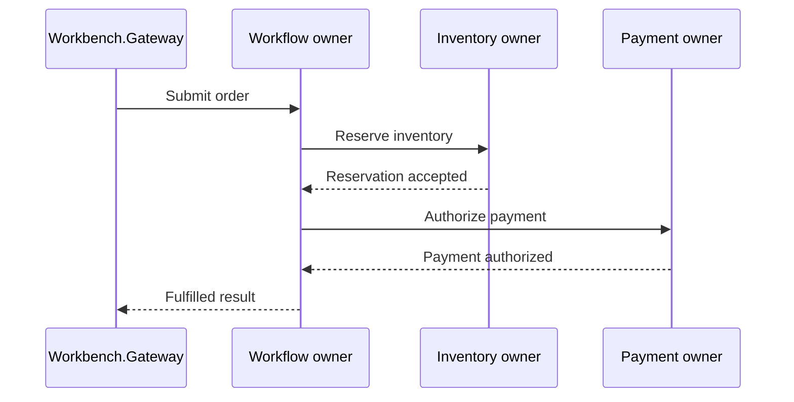
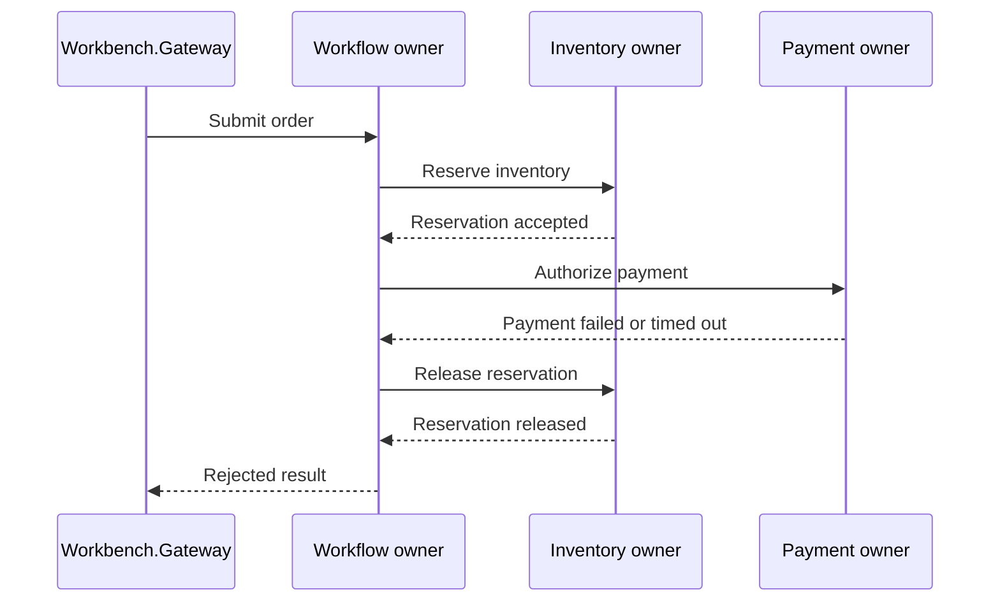
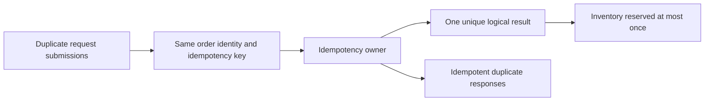

# Scenario guide

This guide documents the deterministic scenarios used by the architecture workbench.

Each scenario exercises the same order workflow through two implementation styles:

- a microservices implementation with explicit HTTP service and persistence boundaries
- a virtual actor implementation with stateful grain identities and identity-oriented coordination

Every scenario run compares both implementations through the same request semantics and normalized result contract. The goal is not to identify a universal winner. The goal is to make differences in state ownership, concurrency, failure policy, idempotency, contention, and operations visible.

## How to read this guide

Each scenario follows the same structure:

- **Purpose** explains what the scenario demonstrates
- **Default inputs** records the values used by the Workbench UI
- **Expected result** describes the normalized outcome for each implementation
- **Microservices interpretation** identifies the relevant service and persistence boundaries
- **Virtual actors interpretation** identifies the relevant grain identities and runtime behavior
- **Architecture lesson** explains the ownership, concurrency, or failure-handling principle
- **Operational validation** identifies useful evidence in the Workbench UI and Aspire dashboard
- **Evolution note** highlights compatibility or policy implications when the behavior changes

The expected values describe the default scenario configuration. Advanced settings can produce different counts while preserving the same semantic rules.

## Common result terminology

Result cards use the following terms consistently:

- **Total request submissions** is the number of attempts sent to one implementation
- **Unique successful orders** is the number of distinct logical orders that completed
- **Rejected submissions** is the number of logical submissions that were rejected
- **Idempotent duplicate responses** is the number of repeated submissions that returned an established logical result
- **Remaining inventory** is the final observed inventory quantity
- **Elapsed time** is local workbench feedback, not benchmark evidence

A request submission and a unique logical order are not always the same thing. This distinction is especially important for duplicate and concurrent scenarios.

## Scenario shapes

### Successful workflow

### Compensated workflow

### Duplicate workflow

The diagrams explain the scenario shape. They do not represent live workflow events or replace distributed traces.

## Successful order

### Purpose

Demonstrates the happy path. Inventory is available, payment succeeds, and the order completes.

### Default inputs

- Initial stock: `10`
- Quantity: `1`
- Request submissions: `1`

### Expected result

- Total request submissions: `1`
- Unique successful orders: `1`
- Rejected submissions: `0`
- Idempotent duplicate responses: `0`
- Remaining inventory: `9`
- Status: `Fulfilled`

### Microservices interpretation

`Orders.Api` coordinates the workflow. `Inventory.Api` owns product inventory and reservation state. `Payments.Api` owns payment authorization. The workflow crosses explicit HTTP and persistence boundaries, and the order coordinator must interpret each downstream result.

### Virtual actors interpretation

`OrderGrain(orderId)` owns the order workflow. `InventoryItemGrain(productId)` owns inventory for one product identity. `PaymentAccountGrain(customerId)` owns payment behavior. Coordination is expressed through grain calls and persisted grain state.

### Architecture lesson

Both designs require explicit ownership of inventory, payment behavior, and the terminal order result. The difference is whether ownership is expressed through services and their data boundaries or through actor identities and actor state.

### Operational validation

The Workbench UI should show one completed logical order and the expected remaining inventory for both implementations. Use the Aspire dashboard to inspect the corresponding logs and distributed trace across the Gateway and relevant backend resources.

### Evolution note

The happy-path result is a shared semantic contract. Renaming status values, changing count meanings, or altering terminal-result behavior can affect the UI, tests, clients, metrics, and documentation even when the transport shape remains compatible.

## Insufficient inventory

### Purpose

Demonstrates business rejection before payment. The requested quantity exceeds available inventory, so the workflow must stop before payment authorization.

### Default inputs

- Initial stock: `1`
- Quantity: `2`
- Request submissions: `1`

### Expected result

- Total request submissions: `1`
- Unique successful orders: `0`
- Rejected submissions: `1`
- Idempotent duplicate responses: `0`
- Remaining inventory: `1`
- Reason: `InsufficientInventory`

### Microservices interpretation

`Inventory.Api` rejects the reservation. `Orders.Api` stops the workflow and must not continue to `Payments.Api`. The inventory service remains the owner of the availability decision and inventory invariant.

### Virtual actors interpretation

`InventoryItemGrain(productId)` rejects the reservation for the product identity. `OrderGrain(orderId)` stops the workflow and records the rejected result.

### Architecture lesson

The component that owns inventory state must decide whether stock can be reserved. Callers should not duplicate availability logic in a way that can diverge from the state owner.

### Operational validation

The result should show one rejection and unchanged inventory. Logs and traces should not show a successful payment authorization attempt after the reservation is rejected.

### Evolution note

Reason values are semantic contracts. Changing `InsufficientInventory` can affect clients, result mapping, tests, dashboards, and diagnostic rules even when the request and response properties do not change.

## Payment failure compensation

### Purpose

Demonstrates compensation after a known downstream failure. Inventory is reserved, payment explicitly fails, and the reservation is released.

### Default inputs

- Initial stock: `10`
- Quantity: `2`
- Request submissions: `1`

### Expected result

- Total request submissions: `1`
- Unique successful orders: `0`
- Rejected submissions: `1`
- Idempotent duplicate responses: `0`
- Remaining inventory: `10`
- Reason: `PaymentFailed`

### Microservices interpretation

`Orders.Api` asks `Inventory.Api` to reserve stock, calls `Payments.Api`, receives an explicit failure, and asks `Inventory.Api` to release the reservation.

### Virtual actors interpretation

`OrderGrain(orderId)` coordinates the same policy through `InventoryItemGrain(productId)` and `PaymentAccountGrain(customerId)`. After payment failure, the order grain requests release from the inventory grain.

### Architecture lesson

Compensation does not transfer ownership of inventory to the workflow coordinator. The coordinator decides that compensation is required, the inventory owner performs and protects the state transition.

### Operational validation

The Workbench result should show rejection and restored inventory. The Aspire trace and logs should show reservation, payment failure, release, and final rejection as one causal workflow.

### Evolution note

Changing compensation from immediate release to delayed or asynchronous recovery changes observable inventory availability and failure semantics. Such a change requires coordinated tests, UI wording, telemetry, and operational guidance.

## Payment timeout after reservation

### Purpose

Demonstrates timeout handling after inventory has already been reserved. The sample treats the timeout as a failed authorization, releases inventory, and rejects the order.

### Default inputs

- Initial stock: `10`
- Quantity: `2`
- Request submissions: `1`

### Expected result

- Total request submissions: `1`
- Unique successful orders: `0`
- Rejected submissions: `1`
- Idempotent duplicate responses: `0`
- Remaining inventory: `10`
- Reason: `PaymentTimeout`

### Microservices interpretation

`Orders.Api` reserves inventory, observes the modeled payment timeout, releases the reservation, and records the rejected result.

### Virtual actors interpretation

`OrderGrain(orderId)` coordinates the same deterministic policy through grain calls. Actor-based workflow state can make the decision visible, but the actor model does not choose the timeout policy automatically.

### Architecture lesson

The workflow owner decides how to interpret an ambiguous downstream outcome. The inventory owner remains responsible for applying the requested release safely.

### Operational validation

The result must distinguish `PaymentTimeout` from `PaymentFailed`. Logs and traces should connect reservation, timeout handling, release, and rejection. Final inventory should return to its initial value.

### Evolution note

A production system may use a pending state and later reconciliation because a timeout does not prove that payment failed. Changing this sample from rejected to pending would be a significant semantic change across contracts, UI, tests, retries, metrics, and operations.

## Concurrent orders

### Purpose

Demonstrates independent order submissions competing for limited stock at the same time.

### Default inputs

- Initial stock: `3`
- Quantity: `1`
- Concurrent request submissions: `10`

### Expected result

- Total request submissions: `10`
- Unique successful orders: `3`
- Rejected submissions: `7`
- Idempotent duplicate responses: `0`
- Remaining inventory: `0`
- Reason: `SomeOrdersRejected`

### Microservices interpretation

`Orders.Api` submits independent workflows. `Inventory.Api` must protect reservation state atomically at its service and persistence boundary so several API calls cannot over-reserve stock.

### Virtual actors interpretation

The independent workflows converge on `InventoryItemGrain(productId)`. The grain identity owns the product state and coordinates reservation attempts for that identity under the configured Orleans scheduling model.

### Architecture lesson

The inventory invariant belongs to the inventory owner, not to callers. Scaling callers or workflow coordinators does not remove the consistency boundary around one stock record or identity.

### Operational validation

Interpret this as one batch containing separate submissions. Completed and rejected counts refer to different logical orders. The final inventory must not become negative, and successful orders must not exceed available stock.

### Evolution note

Changing the reservation strategy can preserve the response contract while changing latency, retry behavior, fairness, and contention. Scenario regression tests should protect the business invariant while allowing intentional implementation changes.

## Hot product contention

### Purpose

Demonstrates many concurrent requests targeting one product identity. The scenario separates correctness from scalability by making the shared contention point visible.

### Default inputs

- Initial stock: `25`
- Quantity: `1`
- Concurrent request submissions: `50`

### Expected result

- Total request submissions: `50`
- Unique successful orders: `25`
- Rejected submissions: `25`
- Idempotent duplicate responses: `0`
- Remaining inventory: `0`
- Reason: `SomeOrdersRejected`

### Microservices interpretation

`Inventory.Api` owns the product state and must protect its invariant. One hot product can concentrate load on one database row, key, lock, transaction, or partition even when several service instances are available.

### Virtual actors interpretation

`InventoryItemGrain(productId)` owns the hot product identity. Identity-local coordination protects correctness, but the same identity can become a hot grain and a throughput boundary.

### Architecture lesson

State ownership protects correctness but does not eliminate contention. Adding service instances or silos does not automatically partition one hot key or actor identity.

### Operational validation

Confirm the completed and rejected counts and final inventory. Use Aspire metrics and traces to inspect the runtime shape, but do not treat one local elapsed-time comparison as benchmark evidence.

### Evolution note

Relieving one hot identity may require repartitioning, batching, reservations, quotas, rate limiting, asynchronous admission, or weaker consistency. Such changes affect the domain model and operational behavior, not only infrastructure capacity.

## Duplicate request

### Purpose

Demonstrates idempotency when the same logical order is submitted concurrently with the same order identity and idempotency key.

### Default inputs

- Initial stock: `10`
- Quantity: `2`
- Duplicate request submissions: `20`

### Expected result

- Total request submissions: `20`
- Unique successful orders: `1`
- Rejected submissions: `0`
- Idempotent duplicate responses: `19`
- Remaining inventory: `8`
- Reason: `IdempotentResultReturned`

### Microservices interpretation

`Orders.Api` must atomically protect the relationship between the idempotency key and one logical order result. An initial lookup and unique index are not sufficient by themselves unless the service also handles concurrent insertion races and returns the established result.

### Virtual actors interpretation

Duplicate submissions target `OrderGrain(orderId)`. Stable identity routes the workflow to the same logical owner, while persisted grain state records the established result.

### Architecture lesson

Idempotency state is domain state. The system needs one owner for the relationship between request identity and logical outcome.

### Operational validation

The key values are total submissions, one unique successful order, idempotent duplicate responses, and inventory reduced once. Logs and traces should not show successful reservation for every duplicate submission.

### Evolution note

Idempotency policy must define key scope, request mismatch behavior, in-progress duplicates, retention, failed outcomes, and restart behavior. Changing those semantics is a behavior-contract change even when the endpoint signature remains the same.

## Cross-scenario lessons

### State ownership is the central comparison

Most scenarios identify the correct owner of state and invariants:

- product inventory belongs to `Inventory.Api` or `InventoryItemGrain(productId)`
- order workflow state belongs to `Orders.Api` or `OrderGrain(orderId)`
- payment behavior belongs to `Payments.Api` or `PaymentAccountGrain(customerId)`
- idempotency belongs to the component that establishes and returns the logical result

The architectures differ less in whether ownership is required than in how ownership is represented and operated.

### Concurrency guarantees require a boundary

Microservices require explicit concurrency control at service-owned persistence or partition boundaries.

Virtual actors align identity-local coordination with the actor runtime, but request scheduling, reentrancy, persistence, cross-actor workflows, and hot identities remain part of the correctness and capacity model.

### Failure handling is policy

Architecture does not decide whether timeout means rejection, retry, compensation, pending confirmation, or reconciliation. It changes how the workflow records and applies that decision.

### Scenario semantics are versioned behavior

Status values, reason strings, idempotency rules, timeout policy, count meanings, and compensation behavior are part of the externally visible contract. Compatibility is broader than JSON shape or method signature.

### Timings are local observations

Elapsed values help explain this development topology. They do not prove general throughput, latency, cost, or scalability advantages.

## Observability guidance

Use the Workbench UI to inspect normalized outcomes and explanatory timelines.

Use the Aspire dashboard to inspect detailed runtime evidence:

- resource state and endpoints
- structured logs
- distributed traces
- scenario metrics
- health and readiness
- runtime dependencies

The Workbench timeline explains the intended scenario. The Aspire trace shows the operations that actually occurred in the composed application.

Do not place customer IDs, product IDs, order IDs, idempotency keys, or other unbounded identifiers into metric dimensions. Use logs and traces for high-cardinality investigation, subject to the repository's data-handling guidance.

## What the scenarios do not prove

The scenarios do not prove:

- that one architecture is universally better
- production performance or cost
- production security or resilience
- correctness under every failure combination
- safe multi-region operation
- complete timeout reconciliation
- automatic scalability for hot keys or identities

They are intentionally small and deterministic so the comparison remains focused on state ownership, workflow coordination, concurrency, idempotency, compensation, and operational visibility.

## Related documentation

- [Problem](01-problem.md)
- [Microservices design](02-microservices-design.md)
- [Virtual actors design](03-virtual-actors-design.md)
- [Trade-offs](07-tradeoffs.md)
- [Local validation](09-local-validation.md)
- [UI dashboard](10-ui-dashboard.md)
- [End-to-end validation](11-end-to-end-validation.md)
- [Release, versioning, and rollback](14-release-versioning-and-rollback.md)
- [Observability and operations](16-observability-and-operations.md)
- [Known limitations](17-known-limitations.md)
- [Out of scope](18-out-of-scope.md)
