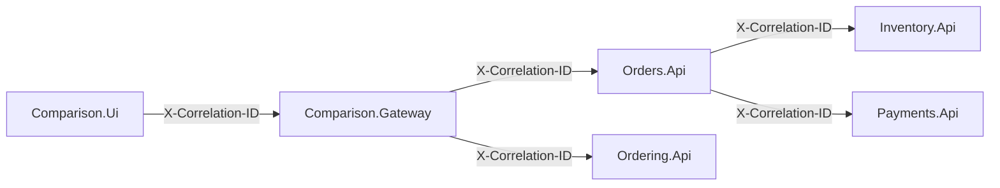

# Correlation ID logging

This document explains the simplified correlation mechanism used by the sample.

The purpose of this document is narrow: it describes how `X-Correlation-ID` flows through the local comparison sample and why this lightweight approach was chosen instead of a full observability platform.

Broader runtime diagnostics, metrics, alerting, and operational interpretation are covered in [16-observability-and-operations.md](16-observability-and-operations.md).

## Production direction

Production applications should generally use end-to-end OpenTelemetry-based observability instead of a custom correlation-only mechanism.

In a production system, trace context should flow consistently through the whole request path, including:

- UI or external entry point
- gateway
- backend APIs
- service-to-service HTTP clients
- actor runtime boundaries
- persistence operations
- logs
- metrics
- traces

A production-grade approach would usually include:

- W3C Trace Context propagation
- .NET `Activity` and `ActivitySource`
- OpenTelemetry instrumentation
- structured logs correlated with trace and span identifiers
- metrics emitted through the same observability strategy
- exporters to an observability backend
- dashboards and alerting based on collected telemetry

That full observability stack is intentionally not implemented in this repository. The repository is designed to compare workflow ownership, state boundaries, concurrency, idempotency, and failure handling between microservices and virtual actors. Adding full OpenTelemetry infrastructure would be valuable in production, but it would add setup and operational complexity that could distract from the core comparison.

## Sample approach

For simplicity, the sample uses a pragmatic custom HTTP header:

```text
X-Correlation-ID
```

The UI sends this header when executing a scenario.

The gateway stores the value in an asynchronous correlation context and forwards it to backend HTTP calls.

Backend APIs add the value to structured logging scopes when the header is present.

The UI displays the correlation ID for the completed scenario run so the same value can be searched in logs.

This gives enough diagnostic value for the local comparison sample without requiring tracing infrastructure, exporters, dashboards, or an observability backend.




## Where correlation appears

A scenario run can involve multiple processes, depending on the selected architecture:

- `Comparison.Ui`
- `Comparison.Gateway`
- `Orders.Api`
- `Inventory.Api`
- `Payments.Api`
- `Ordering.Api`

The correlation ID makes it possible to search logs across these processes for the same scenario run.

For example:

- in the microservices path, the same correlation ID should connect gateway, order, inventory, and payment logs
- in the virtual actor path, the same correlation ID should connect gateway, ordering API, and actor workflow logs

## Why this is not part of the scenario contract

Correlation IDs are diagnostic metadata rather than business data.

Keeping correlation in headers avoids mixing observability concerns into scenario request and result contracts.

The scenario contract should describe business input and business result shape. The correlation ID should help diagnose how that result was produced.

This distinction matters because changing observability infrastructure should not require changing scenario contracts.

## Limitations of the sample approach

The custom `X-Correlation-ID` approach is intentionally simple.

It does not provide everything a full observability implementation would provide. In particular, it does not model:

- trace spans
- parent-child span relationships
- automatic HTTP client instrumentation
- automatic database instrumentation
- actor runtime instrumentation
- metrics correlation
- export to tracing backends
- cross-service latency breakdowns

The custom header is enough to search logs for a local scenario run, but it is not a replacement for production-grade tracing.

## Practical takeaway

Use OpenTelemetry end to end in production applications.

Use the sample's `X-Correlation-ID` mechanism as a deliberately small local diagnostic aid for the comparison repository.

The important architectural point is the same in both cases: diagnostic context should flow across process, runtime, and persistence boundaries without becoming part of the business contract.
