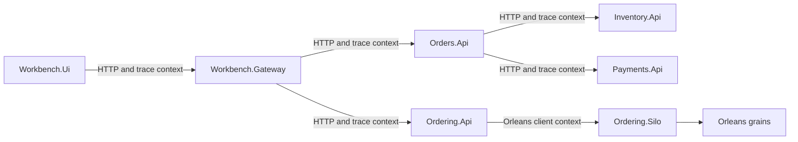

# Correlation and trace context

This document explains how diagnostic context moves through the architecture workbench.

The repository uses complementary mechanisms:

- W3C trace context and .NET `Activity` provide distributed tracing context
- OpenTelemetry instrumentation records traces and metrics
- `X-Correlation-ID` provides a stable, human-readable request correlation value for structured logs and HTTP boundaries where it is supplied
- the Aspire dashboard provides the development view for resources, logs, traces, and metrics

Correlation and trace identifiers are diagnostic metadata. They are not part of the business scenario contract.

## Why correlation matters

One scenario run can cross several runtime boundaries.

The microservices path can involve:

- `Workbench.Gateway`
- `Orders.Api`
- `Inventory.Api`
- `Payments.Api`

The virtual actor path can involve:

- `Workbench.Gateway`
- `Ordering.Api`
- `Ordering.Silo`
- Orleans grain calls and persistence

Without propagated diagnostic context, logs and spans from one scenario are difficult to distinguish from concurrent work. Correlation makes it possible to connect activity across those boundaries without adding diagnostic fields to business request and response contracts.

## Diagnostic context flow

The diagram shows the main propagation paths. The exact span graph depends on the selected scenario, enabled instrumentation, sampling policy, and runtime behavior.

## Trace context

.NET tracing is based on `Activity` and `ActivitySource`. OpenTelemetry instrumentation observes activities and exports them through the configured telemetry pipeline.

W3C trace context provides:

- a trace identifier shared by related operations
- span identifiers for individual operations
- parent-child relationships
- sampling information propagated with the request

Automatic and custom instrumentation can contribute spans for:

- ASP.NET Core requests
- outgoing HTTP calls
- Entity Framework Core operations
- Orleans runtime activity where instrumentation applies
- custom scenario and architecture operations

Trace context is the primary mechanism for understanding causal relationships and latency across the composed application.

## Correlation ID

`X-Correlation-ID` is a custom HTTP header used as an additional log-correlation value.

Where the header is present:

- the Gateway reads or establishes the correlation value
- outgoing HTTP calls propagate it to relevant backend APIs
- receiving APIs add it to structured logging context
- operators can search logs for the same value across process boundaries

The correlation ID complements trace context. It does not replace trace and span identifiers, and it does not define parent-child relationships between operations.

The Workbench UI does not display the correlation ID. Detailed request correlation, logs, and trace evidence are inspected through the Aspire dashboard and the configured telemetry pipeline.

## Structured logging

Structured logs should preserve stable property names so related events can be queried consistently.

Useful diagnostic properties can include:

- correlation ID
- trace ID and span ID
- service name
- scenario kind
- operation name
- normalized outcome
- bounded architecture or client identity

Do not log sensitive or unbounded request data merely to improve correlation. Avoid placing these values in normal logs or telemetry unless an explicit data-handling policy requires and protects them:

- credentials and tokens
- connection strings
- complete request or response bodies
- customer identifiers
- order identifiers
- product identifiers
- idempotency keys
- persisted state

High-cardinality investigation belongs primarily in carefully governed logs and traces, not metric dimensions.

## Scenario instrumentation

`Hosting.ServiceDefaults` provides shared observability configuration. The workbench adds scenario-specific instrumentation for operations that are meaningful to the comparison.

Scenario activities and metrics can identify bounded values such as:

- scenario kind
- service-client name
- normalized outcome
- duration
- submission, completion, rejection, and idempotent-response counts

Custom trace collection and sampling can prioritize scenario traffic without requiring every development request to be retained. Sampling affects whether a trace is collected, it does not change business execution.

Instrumentation names and tag values should remain stable because dashboards, queries, tests, and operational guidance can depend on them.

## Aspire dashboard

The Aspire dashboard is the primary development diagnostics surface for the composed application.

Use it to inspect:

- resource state and lifecycle
- service endpoints and dependencies
- structured logs
- distributed traces
- metrics
- runtime configuration exposed by the development environment

The Aspire dashboard and Workbench UI are complementary:

- `Workbench.Ui` presents normalized scenario outcomes, topology-aware health, architecture explanation, and trade-offs
- the Aspire dashboard presents lower-level runtime and telemetry information that is intentionally not duplicated in the Workbench

The Workbench timeline explains the intended scenario. The Aspire trace shows the operations that actually occurred.

## Why diagnostic metadata is not part of the scenario contract

Scenario contracts describe business input and normalized business outcomes. Correlation and trace metadata describe how an operation was processed.

Keeping these concerns separate means:

- telemetry infrastructure can change without changing the business contract
- clients are not required to persist diagnostic identifiers as domain data
- scenario regression tests can focus on business semantics
- observability can evolve independently through headers, activities, exporters, and logging configuration

A diagnostic identifier can still be returned by infrastructure where useful, but it should not become part of the logical order or scenario result model without a business requirement.

## Validation

To validate correlation and tracing locally:

1. Start the repository through `Hosting.AppHost`.
2. Open `Workbench.Ui` from the Aspire dashboard.
3. Run a scenario.
4. Inspect the Gateway and backend logs in Aspire.
5. Open the related distributed trace.
6. Confirm that trace context connects the relevant operations.
7. Where `X-Correlation-ID` is present, confirm that the same value appears in the expected structured logs.
8. Confirm that logs and telemetry do not expose sensitive or unbounded request values.

The microservices and virtual actor paths do not need identical span graphs. Validation should focus on causal continuity, useful operation names, accurate status, and safe diagnostic context.

## Limitations

The repository demonstrates development observability, not a complete production observability platform.

It does not provide a production decision for:

- telemetry storage and retention
- multi-tenant access control
- alerting and escalation
- service-level objectives
- incident response
- telemetry cost management
- sensitive-data governance
- cross-region collection
- long-term trace sampling policy

The Aspire dashboard is a development instrument and detailed diagnostics view. Production systems still require an independently designed telemetry backend and operating model.

## Practical takeaway

Use distributed trace context to understand causal relationships and latency. Use structured correlation values when they improve log search and support workflows. Keep both forms of diagnostic metadata outside the business contract.

The important architectural principle is consistent across both implementations: diagnostic context must flow across process, runtime, and persistence boundaries without becoming domain state.

## Related documentation

- [Microservices design](02-microservices-design.md)
- [Virtual actors design](03-virtual-actors-design.md)
- [Local validation](09-local-validation.md)
- [UI dashboard](10-ui-dashboard.md)
- [End-to-end validation](11-end-to-end-validation.md)
- [Scenario guide](12-scenario-guide.md)
- [Observability and operations](16-observability-and-operations.md)
- [Known limitations](17-known-limitations.md)
- [Out of scope](18-out-of-scope.md)
