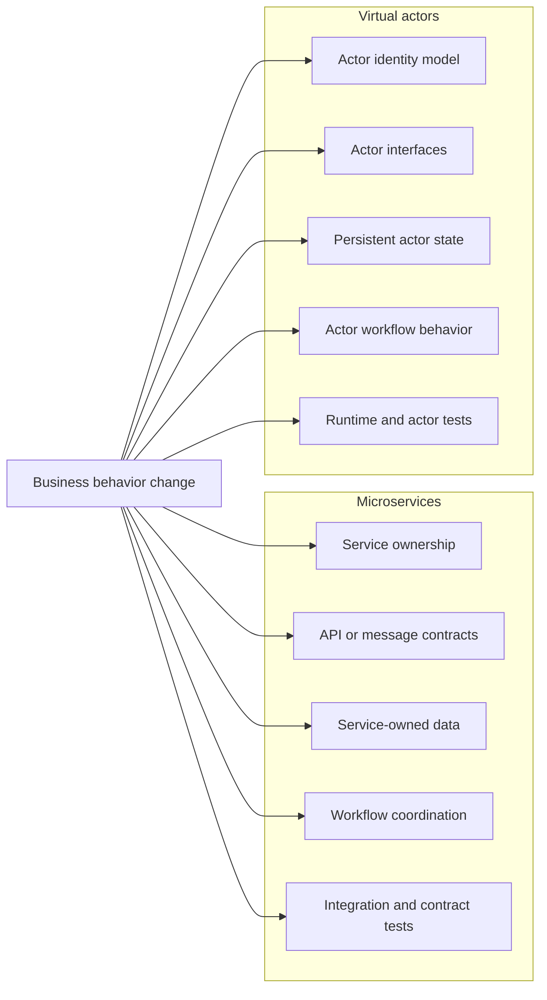

# Maintenance and evolution

Architecture must support change after the first working version is released.

Microservices and virtual actors can both evolve successfully, but they concentrate maintenance work at different boundaries:

- Microservices concentrate change around service ownership, network contracts, service-owned data, and distributed workflow coordination
- Virtual actors concentrate change around actor identity, interfaces, persistent state, runtime behavior, and actor workflow boundaries

The useful question is not which style requires less maintenance. It is:

> When business behavior changes, where does the change land, and how safely can it be understood, tested, released, observed, and reversed?

Release compatibility and rollback are covered in [Release, versioning, and rollback](14-release-versioning-and-rollback.md). This document focuses on long-term ownership, feature evolution, refactoring pressure, testing, and operational confidence.

## Change impact at a glance

The diagram shows where change commonly propagates. It does not imply that every business change affects every boundary.

## Maintenance model

### Microservices

Microservices organize maintenance around independently governed capabilities. A service team may own behavior, data, contracts, deployment, observability, support, and deprecation for one bounded context.

This can isolate change when the boundary is well chosen. A payment-provider change can remain inside a payment service if the external contract and workflow semantics remain stable.

The maintenance cost is that every service boundary becomes a compatibility and operational boundary. A seemingly small workflow change can require coordinated updates across:

- service contracts
- messages or events
- persistence schemas
- callers and consumers
- deployment order
- integration tests
- dashboards and alerts
- documentation and support procedures

Independent processes provide maintenance value only when teams can change them with meaningful autonomy.

### Virtual actors

Virtual actors organize maintenance around durable identities, interfaces, state, and runtime behavior. An actor can colocate identity-specific behavior with the state and invariant it owns.

This can isolate change when the identity boundary is stable. A reservation rule can remain inside the inventory actor if its interface and persisted state remain compatible.

The maintenance cost is that identity design becomes durable architecture. Actor keys, interfaces, persistent state, placement assumptions, scheduling behavior, and runtime compatibility can be difficult to change after data and integrations depend on them.

Poor actor boundaries can be as expensive to evolve as poor service boundaries.

## Adding a new payment provider

A new payment provider is a useful example because payment behavior is separate from inventory ownership but still affects the order workflow.

### Microservices

A payment service can hide provider-specific behavior behind a stable payment contract.

A typical change may include:

- adding a provider adapter
- introducing provider selection and configuration
- mapping provider outcomes to stable domain outcomes
- extending timeout, retry, and idempotency behavior
- adding provider-specific health and telemetry
- updating payment and workflow tests

The workflow coordinator can remain unchanged when the contract and semantics remain stable.

The change spreads when a provider introduces new states, asynchronous confirmation, different idempotency rules, or an ambiguous timeout model. At that point, order state, compensation, client expectations, and operational procedures may also need to evolve.

### Virtual actors

Provider-specific behavior can remain behind a payment actor or a collaborator owned by that actor boundary.

A typical change may include:

- adding a provider adapter
- introducing provider selection into configuration or actor state
- preserving the actor interface where possible
- adding provider-specific workflow transitions
- evolving persistent state
- updating actor and multi-actor workflow tests

The workflow actor can remain stable when the payment actor preserves its contract and outcome semantics.

The change spreads when provider state must be persisted, confirmation becomes asynchronous, or existing actors need migration to a new state model.

## Changing inventory reservation rules

Inventory rules are a strong ownership test because they protect a central invariant.

Examples include:

- reservation by warehouse or location
- allocation priority
- backorders
- reservation expiration
- quotas or customer priority
- partial allocation

### Microservices

The inventory capability should remain the primary owner of reservation rules. Callers should request a reservation rather than reproduce availability logic.

A compatible service contract can contain many internal rule changes. The change becomes broader when request inputs, result meanings, consistency guarantees, or reservation lifecycle behavior change.

Maintenance risk increases when inventory rules leak into workflow coordinators, UI code, reporting services, or other consumers. Duplicated decision logic creates lockstep change and inconsistent outcomes.

### Virtual actors

The inventory actor should remain the primary owner of identity-local reservation state and rules.

Colocating state and behavior can simplify many rule changes, but persistent state must remain readable and migratable. New rules may require:

- reservation-expiration state
- policy-version state
- reminders or timers
- a different actor key
- separate product-location identities
- coordination across several actors

Changing actor identity is a major migration decision once durable state and callers depend on the original key strategy.

## Adding a workflow step

Consider adding fraud or risk evaluation after payment authorization but before completion.

### Microservices

A new workflow step can require:

- a new service or an extension to an existing capability
- a new network contract
- workflow-coordinator changes
- new failure and compensation policy
- deployment and compatibility planning
- additional traces, metrics, health checks, and alerts
- integration and end-to-end tests

The explicit service boundary makes responsibility visible, but the workflow becomes more distributed as more capabilities participate.

A new service should be introduced only when it represents a meaningful ownership or operational boundary. A new class, module, or internal collaborator may be sufficient when independent deployment has no clear value.

### Virtual actors

A new workflow step can require:

- a new actor or actor collaborator
- workflow-actor changes
- a decision about which identity owns the new state
- new cross-actor failure behavior
- state evolution
- additional actor and workflow tests

Keeping the workflow in one actor can make it easy to follow, but that actor can become an oversized orchestrator. A new actor should own a meaningful identity or invariant rather than exist only to split code mechanically.

## Changing timeout policy

A deterministic sample may treat timeout as failure and compensate immediately. A production workflow may instead enter a pending state and reconcile the outcome later.

This is a business-semantic change, not only a resilience setting.

### Microservices

A pending-state policy may require:

- new order states
- durable workflow state
- retry or reconciliation workers
- idempotent downstream queries
- database changes
- new operational alerts
- client and UI changes
- compatibility with in-flight orders created by the previous policy

### Virtual actors

A pending-state policy may require:

- new actor-state fields
- reminders, timers, or external scheduling
- new workflow transitions
- recovery behavior after reactivation
- migration of existing actor state
- client and UI changes

Actor state can express a long-running workflow naturally, but the organization still owns reconciliation policy, retention, observability, and terminal-state decisions.

## Changing idempotency semantics

Idempotency is a behavior contract, not an implementation detail.

Potential changes include:

- key scope and format
- retention period
- request-mismatch handling
- in-progress duplicate handling
- replay of rejected or failed outcomes
- archival and cleanup
- ownership of generated identifiers

### Microservices

A service must atomically protect the mapping between an idempotency key and a logical result. Changes can affect APIs, persistence, concurrency behavior, cleanup jobs, and consumers that rely on safe retries.

A unique index prevents duplicate records, but it does not define the user-facing result or recovery policy by itself.

### Virtual actors

Stable actor identity can route duplicate requests to one logical owner. Changes to key strategy, retention, or replay behavior can affect actor identity, persisted state, callers, and migration tooling.

Actor identity helps coordinate duplicates, but it does not automatically define whether requests are equivalent or how failed and in-progress outcomes should be replayed.

## Changing result semantics

Status, reason, count, and timeline meanings are semantic contracts.

Examples of breaking semantic changes include:

- counting successful HTTP responses instead of unique logical orders
- treating technical failures as business rejections
- changing the meaning of idempotent response counts
- renaming terminal reasons
- changing timeout from rejected to pending
- changing when compensation is considered complete

A field can retain the same name and type while its meaning becomes incompatible.

Treat result semantics as versioned behavior. Update contracts, consumers, tests, metrics, dashboards, and documentation together.

## Refactoring boundaries

### Refactoring microservices

Refactoring inside one service is usually lower risk when public contracts, persistence compatibility, and observable behavior remain stable.

Moving responsibility across services can require:

- contract changes
- data migration
- ownership transfer
- deployment sequencing
- consumer updates
- temporary compatibility paths
- changes to operational ownership

A service extraction or merge should be driven by ownership, coupling, scaling, or lifecycle needs rather than code size alone.

### Refactoring virtual actors

Refactoring inside one actor implementation is usually lower risk when interfaces, identity, persisted state, and scheduling assumptions remain stable.

Moving responsibility across actor boundaries can require:

- key migration
- state migration
- interface and message changes
- workflow compatibility
- placement and performance review
- temporary forwarding or compatibility logic

Actor extraction or consolidation should be driven by identity, invariant, workload, and ownership needs rather than class size alone.

## Testing maintenance

Tests must evolve with behavior without becoming coupled to incidental implementation details.

### Microservices test focus

Useful coverage includes:

- service API and message compatibility
- persistence and migration behavior
- concurrency and idempotency races
- compensation
- timeout and retry policy
- integration and end-to-end workflows
- observability and health behavior where operationally significant

### Virtual actor test focus

Useful coverage includes:

- actor behavior and identity
- actor-interface compatibility
- persistent-state serialization and migration
- scheduling, concurrency, and reentrancy assumptions
- activation and recovery
- multi-actor workflows
- cluster and persistence integration

### Shared behavioral tests

Scenario or acceptance tests should protect externally visible semantics across both implementations:

- terminal status and reason
- unique logical outcomes
- rejection counts
- idempotent replay
- remaining state
- compensation results

This allows internal designs to evolve independently while preserving the comparison contract.

## Observability maintenance

Observability must evolve with the system.

When changing behavior, review:

- activity and span names
- structured logging event IDs and property names
- metric names and bounded dimensions
- health checks
- topology definitions and dependency requirements
- dashboards and queries
- operational guidance

Telemetry is an operational contract. Renaming a metric or log property can break dashboards and investigations even when business behavior remains correct.

Avoid preserving poor telemetry indefinitely, but migrate it deliberately and document the transition.

## Documentation maintenance

Documentation should change with behavior, not after it becomes inaccurate.

Update the narrowest relevant document when changing:

- architecture or ownership boundaries
- scenario behavior or defaults
- result semantics
- hosting and local validation
- health and topology interpretation
- observability
- release or compatibility guidance
- known limitations and scope

Avoid repeating the same detail across the root README, project READMEs, and several design documents. The root README should orient readers, project READMEs should explain implementation areas, and numbered documents should contain the deeper architectural narrative.

## Team ownership implications

### Microservices

Healthy ownership means a team can own a capability end to end, including behavior, data, contracts, deployment, support, and deprecation.

Warning signs include:

- many teams changing the same service
- one rule spread across several services
- unclear database ownership
- frequent coordinated releases
- incidents that have no clear owner

### Virtual actors

Healthy ownership means a team can own an actor-backed domain area, including identity, interfaces, state, persistence, runtime behavior, and operational visibility.

Warning signs include:

- actors becoming generic shared infrastructure
- identity strategy changing without migration ownership
- runtime knowledge concentrated in one person
- grain families without a bounded-context owner
- incidents requiring platform specialists for ordinary domain diagnosis

Ownership must follow the durable boundary, not merely the source-code folder.

## How this repository illustrates maintenance concerns

The repository provides a small illustration rather than a complete production evolution model.

The microservices implementation shows how an order workflow can change across `Orders.Api`, `Inventory.Api`, `Payments.Api`, their persistence boundaries, and shared contracts.

The virtual actor implementation shows how similar changes affect `OrderGrain(orderId)`, `InventoryItemGrain(productId)`, `PaymentAccountGrain(customerId)`, grain interfaces, persisted state, `Ordering.Api`, and `Ordering.Silo`.

The Workbench acceptance and scenario regression tests protect normalized outcomes while allowing the internal implementations to differ.

The .NET Aspire AppHost provides the development composition and diagnostics environment. It is not a production release, migration, or operational blueprint.

## Maintenance checklist

Before changing existing behavior, ask:

- Which component or identity owns the state?
- Which invariant or workflow policy changes?
- Does the change alter status, reason, count, or timeline semantics?
- Does it change an API, message, or actor interface?
- Does it require database or actor-state migration?
- Can old and new versions coexist during rollout?
- Can the change be rolled back after durable state is written?
- Are retries and duplicate requests still safe?
- Are compensation and ambiguous outcomes still observable?
- Which focused and scenario-level tests must change?
- Which telemetry and health definitions must change?
- Which documentation should be updated?
- Is the ownership boundary still appropriate after the change?

## Key takeaways

- Maintenance complexity does not disappear, it moves to different boundaries
- Microservices require contract, integration, data-ownership, and independent-service discipline
- Virtual actors require identity, interface, state-evolution, runtime, and hot-identity discipline
- A stable method signature or JSON shape does not guarantee semantic compatibility
- Tests should protect externally visible behavior while allowing implementation evolution
- Telemetry, health definitions, and documentation are part of maintainable system behavior
- The quality of an architecture is visible in how safely it can change, not only in how cleanly the first version is built

## Related documentation

- [Microservices design](02-microservices-design.md)
- [Virtual actors design](03-virtual-actors-design.md)
- [Development comparison](04-development-comparison.md)
- [Deployment comparison](05-deployment-comparison.md)
- [Scaling comparison](06-scaling-comparison.md)
- [Trade-offs](07-tradeoffs.md)
- [Organizational scaling and architecture fit](08-organizational-scaling-and-architecture-fit.md)
- [Scenario guide](12-scenario-guide.md)
- [Release, versioning, and rollback](14-release-versioning-and-rollback.md)
- [Observability and operations](16-observability-and-operations.md)
- [Known limitations](17-known-limitations.md)
