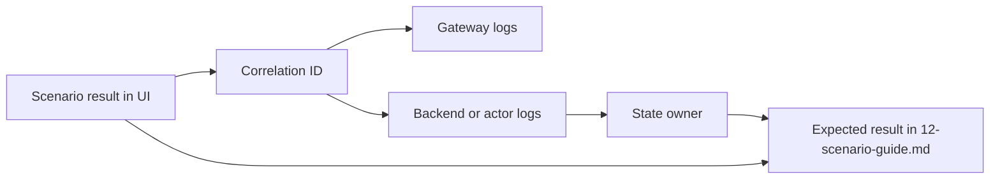

# Observability and operations

This document explains how to operate, diagnose, and reason about the comparison sample at runtime.

Correlation mechanics are covered separately in `[13-correlation-id-logging.md](13-correlation-id-logging.md)`. This document focuses on the broader operational view: what to observe, how to diagnose scenario behavior, which runtime dimensions matter, and how the microservices and virtual actor implementations differ operationally.

## Production observability direction

Production applications should generally use end-to-end OpenTelemetry-based observability.

A production-grade implementation should correlate traces, logs, and metrics across the whole request path:

- UI or external entry point
- gateway
- backend APIs
- microservice-to-microservice HTTP calls
- actor runtime boundaries
- grain workflow execution
- persistence operations
- background processing, if introduced later

A production implementation would typically use W3C Trace Context, .NET `Activity` and `ActivitySource`, OpenTelemetry instrumentation, structured logs correlated with trace and span identifiers, metrics, exporters, dashboards, and alerts.

The local sample intentionally uses a lightweight `X-Correlation-ID` mechanism instead. That keeps the repository easy to run and keeps the focus on architecture comparison rather than observability platform setup.

## Summary

The sample uses lightweight header-based correlation for local diagnostics. The UI generates a correlation ID for a scenario run, sends it through `X-Correlation-ID`, and displays it next to the completed run summary.

That mechanism is useful for local diagnostics and for explaining how correlation works. It is not intended to be a replacement for production-grade tracing.

The broader operational goal is to understand whether each architecture implementation preserves the same scenario behavior, protects the same invariants, and exposes enough diagnostic information to explain unexpected results.

## Diagnostic goals

A scenario run should answer these operational questions:

- Which UI action triggered this run?
- Which gateway request handled this run?
- Which backend calls belong to the same run?
- Which architecture path was executed?
- Which product, order, and idempotency key were involved?
- Which state owner accepted, rejected, reserved, released, or completed work?
- Did unique successful, rejected, and idempotent duplicate response counts match the expected scenario behavior?
- Did final inventory preserve the scenario invariant?
- Did the observed timeline match the expected workflow sequence?

The most important operational questions are about state ownership, invariant protection, and failure policy.

## Correlation ID usage

The correlation ID is diagnostic metadata. It is intentionally not part of scenario request or result contracts.

The header name is:

```text
X-Correlation-ID
```

Example value:

```text
run-9f2f4a0f1c17482a8a0cc0c45c6d9a7e
```

For details on why the sample uses this custom header and why production systems should normally use OpenTelemetry, see `[13-correlation-id-logging.md](13-correlation-id-logging.md)`.

## How to trace one scenario run

1. Run a scenario from the UI.
2. Copy the correlation ID shown in the completed run summary.
3. Search gateway logs for that exact value.
4. Identify which architecture path ran.
5. Search backend logs for the same correlation ID.
6. Compare the UI timeline with service or actor logs.
7. Check that final result metrics match the expected scenario behavior in `[12-scenario-guide.md](12-scenario-guide.md)`.

For the microservices path, inspect:

- `Comparison.Gateway`
- `Orders.Api`
- `Inventory.Api`
- `Payments.Api`

For the virtual actor path, inspect:

- `Comparison.Gateway`
- `Ordering.Api`
- grain workflow logs, when enabled

The diagnostic flow can be summarized like this:




## Important diagnostic dimensions

The most useful diagnostic dimensions are:

- `CorrelationId`
- `Scenario`
- `Architecture`
- `ProductId`
- `OrderId`
- `IdempotencyKey`
- `TotalRequestSubmissions`
- `UniqueSuccessfulOrders`
- `RejectedSubmissions`
- `IdempotentDuplicateResponses`
- `RemainingInventory`
- `ElapsedMilliseconds`
- `Reason`

Not every component logs all of these today. The correlation ID is the minimum common dimension that links a run together.

The scenario terminology should stay consistent across UI result cards, logs, tests, and documentation.

## Scenario-specific operational notes

### Successful order

Expected operational shape:

- one request submission
- one inventory reservation
- one payment authorization
- one completed order
- inventory reduced by requested quantity

Unexpected signs:

- payment called before inventory reservation
- multiple reservations for one request submission
- completed order with unchanged inventory
- missing correlation ID in backend logs

### Insufficient inventory

Expected operational shape:

- one request submission
- inventory rejects reservation
- payment is not attempted
- inventory remains unchanged
- reason is `InsufficientInventory`

Unexpected signs:

- payment authorization appears in logs
- inventory changes despite rejection
- reason is not `InsufficientInventory`

### Payment failure with compensation

Expected operational shape:

- inventory is reserved
- payment explicitly fails
- inventory reservation is released
- order is rejected
- final inventory equals initial stock
- reason is `PaymentFailed`

Unexpected signs:

- missing release after payment failure
- completed order after payment failure
- final inventory lower than initial stock

### Payment timeout after reservation

Expected operational shape:

- inventory is reserved
- payment timeout is reported
- inventory reservation is released
- order is rejected with `PaymentTimeout`
- final inventory equals initial stock

Unexpected signs:

- timeout reported as generic payment failure
- inventory not released
- scenario reason differs from `PaymentTimeout`

The sample treats timeout as failed for determinism. A production system might use pending state and reconciliation instead.

### Concurrent orders

Expected operational shape:

- many independent request submissions
- completed count does not exceed available stock divided by requested quantity
- rejected submissions appear when demand exceeds stock
- final inventory is not negative

Unexpected signs:

- more completed orders than stock allows
- negative inventory
- all requests complete despite insufficient stock
- result timeline shows only one successful order instead of aggregate behavior

### Hot product contention

Expected operational shape:

- many submissions target the same product
- the product identity is the contention point
- completed and rejected counts reflect available stock
- inventory does not go below zero

Unexpected signs:

- completed count exceeds stock
- missing rejected submissions when demand exceeds stock
- high elapsed time concentrated around the hot product identity

### Duplicate request

Expected operational shape:

- many submissions reuse the same order identity and idempotency key
- one unique logical order completes
- duplicate submissions return idempotent responses
- inventory is reduced once by requested quantity

Unexpected signs:

- inventory reduced once per duplicate submission
- unique constraint exceptions in `Orders.Api`
- more than one unique successful order
- duplicate responses treated as rejected submissions

## Microservices operations perspective

The microservices-style implementation distributes behavior across service processes.

Operational advantages:

- failures often appear at explicit service boundaries
- each service can expose its own logs and metrics
- service ownership can align with operational ownership
- individual services can be restarted or scaled independently

Operational costs:

- diagnosis requires correlation across multiple services
- network failures and timeouts are part of normal operations
- version skew during deployment can create subtle failures
- dashboards and alerts need to account for service interactions

For this sample, the most important microservices diagnostic path is:

```text
Comparison.Ui
  -> Comparison.Gateway
      -> Orders.Api
          -> Inventory.Api
          -> Payments.Api
```

## Virtual actors operations perspective

The virtual actor-style implementation expresses behavior through actor identities and runtime-managed activations.

Operational advantages:

- per-identity state ownership is easier to reason about
- actor identity is a useful diagnostic dimension
- per-identity serialization can reduce concurrency bugs for stateful invariants
- workflow behavior can be inspected around grain interactions

Operational costs:

- runtime behavior may be less obvious to operators unfamiliar with Orleans
- activation placement and lifecycle matter
- hot grains can become bottlenecks
- grain state storage and serialization require operational discipline

For this sample, useful actor diagnostic dimensions include:

- order grain identity
- inventory item grain identity
- payment account grain identity
- scenario name
- correlation ID

## Metrics to watch

This sample does not implement a full metrics backend, but the result model exposes useful operational signals.

### Correctness metrics

- unique successful orders must not exceed stock capacity
- remaining inventory must not go below zero
- duplicate submissions must not create multiple unique orders
- compensation scenarios should restore inventory

### Performance indicators

- elapsed milliseconds per architecture
- elapsed milliseconds per scenario
- elapsed time under hot product contention
- elapsed time under duplicate request concurrency

These timings are local demo indicators, not benchmark proof.

### Reliability indicators

- rejected submissions by scenario
- reason distribution
- timeout count
- idempotent duplicate response count
- backend error responses

## Alerting guidance for a production version

A production version would likely alert on:

- negative inventory
- unique successful orders exceeding available stock
- missing compensation release after payment failure
- increased payment timeout rate
- high duplicate request rate
- unique constraint failures on idempotency keys
- high latency for hot product identities
- high rejected-submission rate outside expected scenarios
- missing correlation or trace context in gateway and backend logs

The local sample does not include these alerts. The list documents what would matter operationally.

## Operational checklist

When a scenario result looks wrong:

1. Copy the UI correlation ID.
2. Search gateway logs for the correlation ID.
3. Identify which architecture path ran.
4. Search backend logs for the same correlation ID.
5. Verify total request submission count.
6. Verify unique successful, rejected, and idempotent duplicate response counts.
7. Verify final inventory.
8. Compare the result with `[12-scenario-guide.md](12-scenario-guide.md)`.
9. If behavior changed intentionally, update regression tests and docs.
10. If behavior changed unintentionally, inspect the state owner for the affected invariant.

## Key takeaways

- Production applications should generally use OpenTelemetry end to end.
- The local sample uses custom correlation only to avoid observability platform complexity.
- Correlation is mandatory once a workflow crosses process boundaries.
- Actor-based workflows still need correlation; fewer HTTP boundaries do not remove operational diagnostics.
- The most important operational questions are about state ownership, invariant protection, and failure policy.
- Logs, metrics, traces, tests, and docs should use the same scenario terminology.
- Diagnostic context belongs in observability infrastructure, not business contracts.
